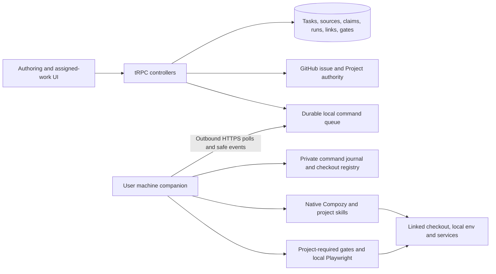

# TechSpec: Assigned Issue Workspace and Local Project Execution

## Executive Summary

Implement the full scope of the PRD's **Focused issue authoring**, **Assigned Ready discovery**, **Claim and active work**, **Planning and downstream work**, **Per-user local project link**, and **Project-defined skills, gates, and Playwright**. Keep `tasks.id` and existing planning/spec/task/package history. Introduce verified GitHub issue-source snapshots and a reconciled first-claim record instead of fabricating publication attempts for imports. Make authoring administrator-only and downstream mutations operator-only, with current project and personal GitHub authorization on every protected read or mutation.

The user selected an outbound HTTPS local companion on 2026-10-06. The companion runs Compozy and project gates on the developer's machine, retains private paths and credentials locally, and sends bounded sanitized results to the hosted service. Preserve existing eligible hosted execution choices explicitly. This adds a command journal, machine pairing, link revisions, and gate evidence while avoiding a new package, parallel workflow engine, or general browser-control interface. The remaining architecture follows repository patterns; no additional user question is needed. Ownership transfer is explicitly parked: a departed or ineligible operator blocks new work without silent reassignment.

This is a design deliverable; the functionality described below is not yet implemented. The inspected working tree includes ongoing software-configuration and unified-flow work. Implement against the resulting reconciled contracts, preserve unrelated changes, and allocate migration numbers from the journal at implementation time.

## System Architecture

### Component Overview

Keep transport → class controller → contextual service/DAO → infrastructure. Application contracts belong under `packages/api/src/application/`; implementations under `infra/`. Extend existing contexts where appropriate. New TypeScript files/classes stay within 100 lines and methods within 30 lines; split by responsibility, without creating one service per endpoint.

| Component | Responsibility and location | Dependencies |
| --- | --- | --- |
| AuthoringAccessPolicy | Extend `controllers/tasksController.ts`, `taskPublicationController.ts`, capture/dictation entry paths with current administrator plus original-author rules | Existing `ProjectAccessService`, personal repository access, task DAO |
| AssignedIssueGateway / assignedIssueRules | Extend `application/github/projectBoardGateway.ts`; implement paginated discovery and fresh issue/board checks in `infra/github/` | Existing GitHub HTTP/OAuth boundary |
| IssueClaimService / IssueClaimDao / claim reconciler | `application/services/assigned-issues/`, `application/database/dao/issueClaimDao.ts`, `infra/database/dao/assigned-issues/`; reserve, dispatch, reconcile, replay | PostgreSQL, gateway, source store |
| WorkAuthorization | Shared downstream policy in `application/services/assigned-issues/workAuthorization.ts`; distinguish reads, operator mutations, worker dispatch | Current membership/admin visibility, personal repository authorization, completed claim, fresh provider facts |
| IssueSourceService / IssueSourceDao | Immutable source snapshots and deliberate source re-evaluation in the assigned-issues context | Verified GitHub issue, tasks/publication receipts, planning history |
| Existing planning/spec/task-flow controllers and workers | Preserve routes, actions, review and artifact contracts; consume pinned sources and operator/requester identities | Source store, WorkAuthorization, existing DAOs/executors |
| ConnectorPairingService / MachineController | `application/services/local-execution/`, `controllers/localMachineController.ts`, corresponding DAO/infra files | Session-based confirmation, machine credential hashes, protocol schemas |
| LocalLinkService / LocalCheckoutRegistry | User/project current link and private machine registry; preparation and readiness | Repository node identity, real Git root, revisioned links, companion capability probes |
| LocalCommandService / LocalActionExecutor / LocalCommandJournal | Durable HTTPS queue, fenced execution/cancellation/interactions, local replay recovery | Existing `ActionExecutor`, Compozy gateways, local filesystem journal and locks |
| GatePolicyResolver / GateRunner / GateSettlement | Project obligations, structured execution outcomes, success enforcement | Applicable instructions/skills, local commands/Playwright, durable gate ledger |
| EvidenceSanitizer / shared DTO mappers | Sanitization before egress, safe documents/activity/diagnostics, bounded browsing | Existing spec redaction/event normalization, local secret inventory and artifact inspection |
| AssignedWorkspace / LocalProjectSettings / navigation | New feature-owned work screens, operator/observer views, private setup and gate evidence | Existing tRPC callers, project shell, domain UI primitives |



### Repository grounding and required changes

| Inspected boundary | Current behavior | Design consequence |
| --- | --- | --- |
| `infra/database/schema/tasks/records.ts` | Author required; published status gates planning | Allow nullable author for imported tasks; add explicit imported origin/status, preserve authored values |
| `schema/tasks/operations.ts`, `planning.ts` | Plan operations and decisions require publication attempt | Add source snapshot association; preserve historical publication associations and hashes |
| `dao/tasks/planningStart.ts`, `planningWorkerClaim.ts`, `planningWorkerInput.ts`, `planningProjection.ts` | Direct publication joins and author authorization | Read pinned source, recorded requester, completed claim and current eligibility |
| `controllers/taskPlanningController.ts` | Approving planning invokes `moveToReady` | Remove that side effect; claim owns the initial `In Progress` transition |
| `controllers/taskSpecController.ts`, `taskFlowController.ts`, spec DAO guards | Original author owns downstream controls | Apply WorkAuthorization in controllers and transaction acceptance guards |
| `infra/taskFlowWorkerComposition.ts`, `runWorkspaceProvider.ts`, `localProjectAccess.ts` | Uses author credentials and one server local path | Use accepted requester; route user-machine local targets to the companion |
| `schema/tasks/taskExecution.ts`, `dao/tasks/taskFlowMappers.ts` | DB workspace check excludes local; mapper falls back to isolated | Add local link/revision persistence and exact discriminated round-trip |
| `taskExecutionRuns.ts`, `application/database/dao/taskFlowTypes.ts` | DB has requestedBy, RunRecord/mapper omit it | Carry requester and immutable execution provenance end to end |
| `spec/compozy/snapshotRunExecutor.ts` | Hard-coded `/workspace`; lifecycle completion can settle success | Parameterize root via launcher; require gate settlement for gated local actions |
| `features/issues/issue-composer/` | Chat, planning, spec and unified execution share one feature | Retain authoring there; move downstream flow ownership into assigned work |

### Requirements traceability

| PRD goal / story | Technical owner |
| --- | --- |
| Authoring ends at publication; US-001, US-002 | AuthoringAccessPolicy, IssueComposer, project navigation |
| Open assigned Ready discovery; US-003 | AssignedIssueGateway, assignedIssueRules, AssignedWorkspace queue |
| Single operator and durable work item; US-004 | IssueClaimService, source identity uniqueness, fenced reconciler |
| Active work after Ready; US-005 | IssueClaimDao active query, work detail route, shared task identity |
| Assessment and explicit downstream journey; US-006, US-007 | IssueSourceService, existing planning/spec/task-flow services and operator policy |
| Shared observation; US-008 | WorkAuthorization, shared DTO mappers, observer work view |
| Each user's checkout; US-009 | Pairing, LocalLinkService, LocalCheckoutRegistry, private settings |
| Project instructions/gates; US-010 | LocalActionExecutor, GatePolicyResolver, journal, checkout lock |
| Accurate Playwright evidence; US-011 | GateRunner, GateSettlement, EvidenceSanitizer, gate view |
| Honest recovery/history; US-012 | Claim/run reconciliation, source versioning, revocation checks |
| Safe host diagnostics; US-013 | MachineController diagnostics, capability codes, operational metrics |

## Implementation Design

### Core Interfaces

These are the primary application dependencies, not browser-maintained duplicate types. Frontend types remain inferred from `RouterInputs` and `RouterOutputs`. Named application errors are translated by controllers.

```ts
type WorkScope = {
  projectId: string;
  taskId: string;
  actorId: string;
  sourceSnapshotId: string;
  claimRevision: number;
};
interface WorkAuthorization {
  requireRead(input: { projectId: string; taskId: string; actorId: string }): Promise<void>;
  requireOperate(input: { projectId: string; taskId: string; actorId: string }): Promise<WorkScope>;
}
```

```ts
type VerifiedIssueSource = {
  snapshotId: string;
  origin: "flow_dev" | "external";
  repositoryId: string;
  repositoryNodeId: string;
  issueNodeId: string;
  issueNumber: number;
  issueUrl: string;
  title: string;
  bodyMarkdown: string;
  contentHash: string;
  githubUpdatedAt: string;
};
```

```ts
type ClaimInput = {
  projectId: string; issueNodeId: string; boardItemId: string;
  actorId: string; requestKey: string;
};
type ClaimResult = {
  taskId: string; state: "pending" | "uncertain" | "failed" | "claimed";
  operatorId: string | null; reason: string | null; replayed: boolean;
};
interface IssueClaimService {
  claim(input: ClaimInput): Promise<ClaimResult>;
  reconcile(input: { projectId: string; taskId: string; actorId: string }): Promise<ClaimResult>;
}
```

```ts
type LocalTarget = {
  machineId: string; linkId: string; linkRevision: number; checkoutHandle: string;
};
type PreparedLocalAction = {
  preparationId: string; expiresAt: string; target: LocalTarget;
  sourceSnapshotId: string; checkoutDigest: string; gateManifestHash: string;
};
interface LocalActionExecutor {
  execute(request: ExecutionRequest): Promise<ExecutionResult>;
  reconcile(request: ExecutionRequest): Promise<ReconcileResult>;
  cancel(request: ExecutionRequest): Promise<ReconcileResult>;
}
```

```ts
type LocalCommand = {
  protocolVersion: 1; commandId: string; machineId: string; projectId: string;
  runId: string; actorId: string; fence: number; leaseExpiresAt: string;
  kind: "prepare" | "start" | "inspect" | "cancel" | "answer";
  target: LocalTarget; payloadHash: string; payload: Record<string, unknown>;
};
type LocalEvent = {
  protocolVersion: 1; commandId: string; runId: string; fence: number;
  sequence: number; kind: "accepted" | "prepared" | "activity" | "gate" | "terminal";
  payload: Record<string, unknown>;
};
```

Use strict, kind-specific Zod discriminated payload schemas for these message unions. `Record` above abbreviates the public example; it never authorizes arbitrary extra keys, shell commands, local paths, or raw diagnostics. Preparation commands have a preparation operation UUID in `runId`; they do not create an execution run.

```ts
type GateResult = {
  runId: string; gateId: string; attempt: number; manifestHash: string;
  state: "passed" | "failed" | "blocked" | "unrun" | "unknown";
  reason: string | null; commandDigest: string; checkedCheckoutDigest: string;
  exitCode: number | null; startedAt: string | null; finishedAt: string | null;
  evidenceIds: string[];
};
interface GatePolicyResolver {
  resolve(input: { checkoutHandle: string; actionKind: string }): Promise<GateManifest>;
}
interface EvidenceSanitizer {
  sanitize(input: { kind: string; content: Uint8Array }): Promise<SafeEvidence | null>;
}
```

`GateManifest` contains applicable relative instruction/skill paths with SHA-256, action kind, required gate IDs, source citations, argv/cwd or project-declared script, timeout, service prerequisites and optional recognized reporter adapter. Manifest commands stay local; the host receives their digest and safe label. `SafeEvidence` contains ID, kind, safe relative label, sanitized content hash/bytes and visibility. Unknown input kinds are rejected.

### Data Models

Use Drizzle/PostgreSQL in the existing API package. New schemas live under `infra/database/schema/tasks/` or `schema/localExecution.ts`, exported through the existing schema entry. Store timestamps as timestamptz and expose ISO strings; GitHub IDs remain strings. All task-linked rows use composite scope/FKs where available.

| Entity | Fields and invariants |
| --- | --- |
| `tasks` extension | `origin: flow_dev | external`; nullable `authorUserId` only for external/imported tasks; `imported` status with the same downstream planning states as published. Existing authored status and history are unchanged. External tasks cannot enter authoring commands. |
| `task_issue_sources` | UUID PK, unique taskId, projectId, repository numeric/node IDs, issueNodeId, issue number/URL, origin, optional actual publicationAttemptId, currentSnapshotId, createdAt. Unique `(projectId, repositoryId, issueNodeId)`; reuse publication identity before import. |
| `task_issue_snapshots` | UUID PK, sourceId/taskId, monotonically increasing revision, title/body, GitHub updatedAt, contentHash, verifiedAt, verifier userId, origin, optional publicationAttemptId. Immutable after insertion. Version hash covers exact title/body and repository/issue identity; board/assignment changes do not invalidate content alone. |
| `task_issue_claims` | One source/task row; candidateUserId, nullable operatorUserId, state `unclaimed | pending | uncertain | failed | claimed`, revision, boardNodeId/itemId/statusFieldId/optionId, sourceSnapshotId, lastVerifiedAt, reason. `operatorUserId` non-null iff claimed; immutable once assigned. |
| `task_issue_claim_attempts` | UUID, sourceId, claimant, requestKey/payloadHash, attempt state, fence, lease owner/expiry, dispatchStartedAt, read-back status, safe failure code, retryAt, createdAt. Unique claimant/project/requestKey and one unresolved attempt per source. Append attempts; never delete failed history. |
| Planning extensions | Operations/decisions get `sourceSnapshotId`, requester userId, source format version. Retain historical publicationAttemptId. New plan operations require sourceSnapshotId and valid inputHash; legacy format requires its publication FK. Replace unique task-only decision with versioned decision history plus one current decision pointer. Preserve old decision IDs and approval rows. |
| Run/provenance extensions | Carry requestedBy through RunRecord and mappers. Snapshot immutable operator ID, source snapshot, machine/link/revision/opaque checkout identity, commit SHA, dirty-state digest, instructions/manifest hashes, runtime/bundle/protocol versions, accepted connection revisions, action and plan revision. Historical rows keep explicit `legacy`/unknown provenance; do not invent machine facts. |
| `local_machines` / `local_pairings` | UUID machine, ownerUserId, safe label, credential hash/version, protocol/capability metadata, last heartbeat, revokedAt; pairing ID, public code hash, private polling-secret hash, expiry, confirmedBy, consumedAt. Labels are sanitized and cannot be filesystem paths. |
| `local_project_links` | UUID, ownerUserId, projectId, machineId, checkoutHandle/opaque checkout key, verified repository IDs, revision, readiness code/time, revokedAt. Unique current `(ownerUserId, projectId)`; link history retained. Machine FK is owner-scoped. No absolute path column. |
| `software_connections` extension | Execution target `host | machine`, nullable machineId/ownerUserId with consistency check; global records stay host. Machine connection metadata uniquely namespaced by machine and local provider ID. Only that user may choose those bindings; credentials stay local. |
| `local_commands` | UUID, machine/user/project scope, execution run FK or preparation-operation FK (exactly one), kind, fence, immutable payloadHash/snapshot, lifecycle, expiry, sequence and acknowledgments. The envelope's runId denotes that operation identity; prepare cannot reference an execution run. Unique operation/kind/request key; starts are single-flight by run. Commands inherit current authorized project scope. |
| `local_checkout_locks` | MachineId + connector-generated canonical checkout key PK, active runId and fence; includes reconciling runs. Aliased paths share the key. Companion holds matching OS/local journal lock; lease expiry alone does not authorize a competing write. |
| `task_run_gates` | RunId/gateId/attempt unique, pinned manifest hash, required flag, status/reason, command digest, checked checkout digest, execution identity, exitCode/times and safe evidence references. Required current results alone influence settlement. |
| `task_run_evidence` | UUID, task/run, visibility, sanitized kind/relative label/hash/byte size, safe payload or existing artifact-store reference. Evidence is scoped and immutable; raw local sources never enter this table. |

The private companion registry stores real canonical roots, credential homes, manifests, raw outputs, allowed service endpoints and a per-run journal outside generated project artifacts with user-only permissions. Links reference random handles rather than path hashes exposed to the host. Store and fsync intent before native runtime submission; persist its runtime IDs and decisive results before uploading. Retain local detailed evidence for 30 days by default, keeping unresolved run journals until resolved; preserve hosted safe history under the existing artifact retention policy.

### Assigned discovery and claim state machine

1. Resolve current project access, linked repository/board and personal GitHub authorization; match the authorization's stable GitHub user ID to the signed-in identity.
2. Query linked ProjectV2 items in pages of 50 with `after`/pageInfo. Filter `Issue` content by open state, exact repository node ID, assignment ID and exact `Ready` option in the Status single-select field. Read `fieldValueByName("Status")`; paginate assignees if membership cannot be established from the first page. Exclude archived board items, draft items, PRs and malformed content. No requirement that Flow Dev created the issue.
3. Return a page of eligible items and an opaque cursor bound to actor, project, board and provider cursor. A scan processes at most two provider pages per response, returns a continuation even when no eligible items appear, and distinguishes `empty` only after the final page. Dedupe by source identity, including on client append/refresh. Never claim through a client-supplied title, body, identity or option ID.
4. After current read authorization, check the existing source/claim binding first: an already claimed issue opens the same durable item for an authorized actor even though it has left Ready. Pending attempts return pending ownership, not completed operator rights. For a new reservation, re-fetch the exact issue and board item and verify `Ready` and a unique `In Progress` option. In a short DB transaction, lock the source identity; reuse a published task or create exactly one imported task/source, snapshot it and reserve one claimant/attempt. Recheck the binding under the lock. Resolve existing publication receipts using both numeric and node issue identity; publication settlement uses the same identity lock and binding uniqueness. Missing legacy node IDs require verified resolution, not a second imported task.
5. After committing, the reconciler records dispatch intent under a fence, checks eligibility again and sets the existing board item's Status option. Do not add a missing item or issue to the board during claim. No database lock/transaction stays open across GitHub network I/O.
6. Read back the same item. `In Progress` confirms the reserved claimant as operator and stores a completed receipt atomically. Changed content/assignment after provider mutation does not erase the claim; it records the actual transition and marks subsequent operation eligibility blocked.
7. A timeout, partial GraphQL result, rate limit after dispatch, crash or malformed acknowledgment leaves the attempt uncertain. Automatic reconciliation performs reads only. If it finds `In Progress`, it settles the original candidate; if an earlier dispatch is definitely settled with `Ready` and current eligibility intact, it marks failed and releases the pending reservation. A second mutation requires the claimant's explicit retry. Other statuses remain blocked for coordination repair; do not overwrite them.

Claim fences protect DB settlement, not GitHub itself. Do not overlap provider writes from different attempts; after a crash around dispatch, keep uncertainty until the request is known settled and read-back can establish its effect. GitHub's status update has no conditional-write guarantee. A user changing status during the check/write window may be overwritten; disclose fresh resulting state and block later mutations if eligibility no longer holds. Never claim a distributed transaction guarantee.

Use retry-after and jittered bounded read retries; 429 never looks like an empty queue. Reconciliation can complete an already authorized claim, but never starts planning or execution.

### Authorization, source changes and downstream compatibility

- Authoring mutations require a fresh administrator designation, current project/personal repository authorization and original-author ownership where existing draft versioning requires it. This includes `start`, `send`, draft/refinement, generation retry, publication, publication reconciliation, and dictation/capture admission. Degrading role cannot reuse an old receipt to mutate. Authorized project readers may inspect historical authoring; imported tasks have no fabricated chat.
- Every read verifies current project visibility and personal repository read access. Bypass the existing five-second personal-access cache for protected issue/history disclosure and mutation admission; cached content is never an authorization grant. Access removal returns safe NOT_FOUND/authorization errors before emitting cached content. Board unavailability blocks discovery/mutations; authorized retained history remains readable when repository access can still be proven. Deleted/closed issues retain authorized history; inaccessible repositories hide private content.
- `requireOperate` requires a completed claim for the actor, open issue, current assignment, exact linked board/item in `In Progress`, non-archived writable repository and current access. Assignment/status drift, missing/renamed `In Progress`, and provider uncertainty each have explicit reasons. Do not transfer ownership or let the author/admin bypass the operator rule.
- Recheck before transaction acceptance and again before queued worker dispatch. Lock task/claim/link revisions inside the transaction to reject stale concurrent commands. Worker context carries accepted requester, sourceSnapshotId and session identity; personal GitHub context, capacity accounting and session checks use requester rather than author. Loss of eligibility after a local action has started preserves its real terminal result, requests a stop at the next safe checkpoint and blocks further input/actions; the developer can always stop it from the companion locally.
- Capture exact GitHub title/body at claim and before deliberate planning. Use existing 256-code-point title, 65,536-code-point body and 256 KiB planning request limits. Reject blank/oversized content with `planning_input_limit`; do not silently truncate. Show the analyzed source revision/time/hash in the work view.
- When title/body differs from the pinned snapshot, return `source_changed` before a new decision or execution. `reconfirmSource` explicitly imports the fresh snapshot and marks downstream approvals for the old source historical. It queues no analysis. The operator must explicitly start planning again. Preserve completed runs/packages and require new compatible decisions/packages for future gated stages; migration-backfilled legacy approvals remain usable if their exact source still matches.
- Retain Dev Control's `/flow-dev/planning/v1` wire protocol. Map verified GitHub title/body into its existing `issue` object with `publicationStatus: "published"` (a real GitHub issue), and use the immutable source snapshot UUID as `issueRevisionId` for new operations. No database publication row is synthesized. Use an internal source-format version for hashes, while old operations reconstruct their original publication hash exactly. Test this adapter with the real planning gateway/envelope parser and provider contract fixtures.
- Replace publication-only eligibility in planningProjection, specSnapshot, SpecEligibilityGate and worker prompt sourcing. Keep route names `prd`, `tech_spec`, `direct_execution`, package review/version semantics, supported legacy stages and unified actions. `direct_execution` still requires existing approved task prerequisites for implementation. Selecting/approving any stage never auto-starts another.

### Local pairing, linking and preparation

The CLI is `pnpm --dir packages/api exec tsx src/cli/localConnector.ts <verb>` in this monorepo; distribute the same bundled entry/runtime resources for installed use without adding a workspace package. Protocol v1 is versioned independently of the pinned Compozy release.

| Verb | Required input / observable result | Failure reason |
| --- | --- | --- |
| `pair` | `--server https://host`; generates private polling secret, prints public code/confirmation URL; after browser confirmation stores machine credential locally and prints safe machine ID | invalid_server, pairing_expired, pairing_pending, pairing_consumed, connector_unavailable |
| `link` | `--project <uuid> --path <root> --expected-revision <n>`; locally confirm folder, validate root/repository, publish only opaque handle and safe label; return link ID/revision | path_invalid, path_limit, path_not_allowed, not_git_root, repository_mismatch, link_changed, machine_revoked |
| `run` | Paired registry; poll commands, heartbeat, execute accepted local actions and send sanitized events | not_paired, machine_revoked, protocol_incompatible, runtime_incompatible, connector_unavailable |
| `status` | Show local machine/project capability codes and own private folder locally; `--run <uuid> --details` opens that run's locally retained evidence through bounded terminal paging; no new execution | not_paired, instructions_invalid, runtime_incompatible, run_unavailable |
| `unpair` | Revoke hosted credential when online, invalidate local credential immediately, stop accepting new commands; keep unresolved journals | connector_unavailable shown as pending remote revocation; never claim remote revocation without acknowledgment |

Pairing code expires after 10 minutes, is single-use, and is associated with a 256-bit polling secret. Browser confirmation requires current sign-in, explicit machine label/fingerprint review and same-origin mutation policy. Hash both secrets at rest; the complete call checks the polling secret and returns a 256-bit machine bearer token once. Machine tokens have a 30-day expiry, can be renewed through the authenticated heartbeat before expiry, and require re-pairing after expiry/revocation. Rotation is idempotent by request key with a brief overlap for the previous token; host stores encrypted one-time delivery only until acknowledgment. Never log codes/tokens, accept browser cookies on machine endpoints, or trust claimed owner IDs from machine payloads.

Local linking resolves symlinks with realpath, requires the canonical Git root rather than a subfolder, checks a locally allowed root, and normalizes GitHub HTTPS/SSH origin. The host verifies that the reported canonical owner/name resolves to the linked repository's stable IDs using the user's authorization; the companion is a trusted user-owned attestation, not a hostile-device proof. Reject credential-bearing remote URLs and paths over 4,096 UTF-8 bytes. Keep the absolute path local. Only one current user/project link is selectable; revision changes use compare-and-set. Changing or unlinking cannot retarget an active run: revoke future use and retain its original target/journal/provenance.

`localProjects.prepareAction` performs an explicitly requested read-only local preparation: repository readiness, native Compozy/provider/model capability checks, instruction/skill discovery, gate manifest validation, local service/browser readiness and dirty-state digest. It returns a preparation operation ID; it never queues the execution itself. Preparation is valid for five minutes. The UI then shows safe checkout/project label, action, dirty-state notice, gate list and runtime choice. `startAction` includes preparationId and confirmed link revision. Recheck source, current claim/access, machine heartbeat, link, provider revision, checkout digest and instructions/manifest hash before accepting and before native dispatch. A changed preparation returns a specific reason and requires a new explicit preparation/start.

### Local command delivery and execution

- Use short HTTPS polls with no inbound listener; steady-state poll/heartbeat every 10 seconds, machine unavailable after 30 seconds without authenticated heartbeat. Lease duration is 60 seconds; offline backoff caps at 60 seconds. No host filesystem or inbound developer service exposure is required.
- Host emits only commands accepted for the owning user's current project and pinned target. `prepare` inspects the project; `start` supplies the existing action snapshot and approved artifact content; `inspect`, `cancel`, and `answer` refer to the same original run. Reject unknown protocol versions, kinds, keys, target changes, expired leases, mismatched payload hashes or foreign machine/run scopes before local effects.
- Extend ActionSnapshot with a machine local target; persist that discriminated workspace exactly in SQL/mappers. Keep host isolated/existing/new choices and runtime/provider adapters. Machine catalog/options include only the user's local providers and compatible models. Do not silently fall back to a host or another checkout.
- Preserve existing configured action-capacity limits for both host and machine attempts. Checkout locks add a second admission constraint; polling or machine reconnect cannot bypass either capacity or explicit start.
- Route local dispatch before requesting host CredentialBroker grants. LocalActionExecutor enqueues the accepted snapshot; the companion selects its local compatible Compozy provider and creates local attempt grants. Host connection rows contain safe metadata only. Extend RuntimeChoiceValidator and TaskFlowOptions to enforce target/owner/provider compatibility; local starts use machine readiness instead of requiring a host Podman image.
- Use CompozyControlGateway and SpecRuntimeGateway on the local machine with a native launcher, protected socket and actual checkout root. Register the existing checkout, install approved artifacts without replacing unrelated working files, and preserve dirty state. A conflicting file produces `artifact_conflict`, never a forced overwrite/reset/stash/clean. Bind bundled flow-spec skills without replacing project skills; applicable AGENTS.md and referenced skill/rule sources still govern execution.
- Native project gates inherit only locally selected environment configuration and local services. Compozy/agent tools are restricted to the linked project and explicitly declared credential/skill/browser resource directories, with no arbitrary host filesystem request API. Required shell commands can execute with user OS rights; the product must not describe this as a kernel sandbox. No project contents or `.env` values are automatically synchronized to the hosted service.
- Claim a server checkout lock and local canonical-root lock before any writing action, across all tasks and project aliases. Manual edits remain possible; detect digest drift before start and gate settlement, preserve existing changes and attribute the run's changed files by before/after digest. Do not attribute all dirty files to the agent.
- Checkout digests cover tracked files and allowed untracked project inputs; exclude only identified runtime evidence/cache directories that cannot supply source or instructions. Gate outputs must not invalidate their own input digest. Keep per-file contents and secret-bearing configuration local; the shared provenance includes only the aggregate digest.
- Fsync `(runId, commandId, payloadHash, fence)` before submission. Duplicate command with the same payload returns its stored acknowledgment/result; a reused ID with a different payload rejects `command_payload_changed`. Recovery queries the original runtime IDs/request key; never call execute again to discover whether it executed. Runtime absence without a durable proof is unknown, not safe to retry.
- Sequence events monotonically per command; duplicate identical sequence/hash is acknowledged, mismatched duplicate rejects `event_conflict`, gaps request resend, stale fence rejects `stale_fence`. Bound each upload to 256 KiB/100 events. Decisive gate and terminal events have reserved journal/storage space and are never dropped with verbose activity.
- Heartbeat loss leaves the hosted run reconciling and retains the checkout lock. On local lease loss, stop starting commands/gates and request cancellation at a safe checkpoint; journal any actual runtime outcome. A reconnect uploads/reconciles existing results. A browser disconnect does not stop a running companion; a machine/runtime failure does not fabricate cancellation or success. Retries create a distinct run only after authoritative terminal reconciliation and a new explicit user command.

### Instructions, gates, Playwright and evidence

Policy discovery reads root and applicable nested AGENTS.md, project rule references, available project skills and explicitly required commands. It uses the existing agent for read-only interpretation, produces a structured manifest with source citations and validates referenced files/scripts/cwd locally. Discovery covers the action's intended file scope; encountering stricter nested rules while editing adds obligations before settlement. Referenced missing files, malformed mandatory rules or unresolvable commands block with `instructions_invalid`/`gate_policy_unresolved`. Absence of an instruction file is allowed when the project declares none; absence of a referenced mandatory file is an error. `package.json` scripts alone do not declare required gates.

The companion also accepts an explicit `.flow-spec/local-gates.json` declaration with a top-level `gates` array. Each entry has `id`, `label`, `argv`, `cwd`, and `kind` (`command` or `playwright`), with optional `timeoutMs`, `serviceUrls`, and `environmentKeys`. It validates relative checkout paths, loopback-only service URLs, unique IDs, and bounded input; the whole file and applicable AGENTS.md files are pinned as manifest sources. Commands and their details remain on the companion. This declaration does not make a `package.json` script mandatory by itself.

The manifest pins mandatory gates applicable to this action, instruction/skill hashes and command digests. Users can inspect requirements but cannot remove required gates through API input. Read the initial linked checkout including uncommitted instruction changes; bind any newly discovered/changed rules and revalidate obligations before finalizing. A change that weakens an already required obligation cannot discard it for the run. Require a fresh current manifest/result set or mark `gate_policy_changed` and block. Gates run through the companion's recorded subprocess runner; agent prose is not execution evidence.

Run the project's declared commands/argv in its own cwd without synthesizing a global test command. Respect declared timeouts; default gate timeout is 15 minutes with an explicit safe timeout reason. Playwright uses the project's installed test runner/config/browser dependencies and existing webServer setup. Check required service endpoints/configured health checks; do not assume that a local port or passing dependency installation proves the application is ready. Do not automatically install browsers or dependencies unless the project action explicitly authorizes that setup. Service access stays local.

| Gate observation | Ledger state / reason | Run consequence |
| --- | --- | --- |
| Actual current command exits 0 with valid required reporter evidence | passed / null | Counts toward required gates |
| Product assertion fails | failed / assertion_failed | Failed action |
| Command exits nonzero without proven setup cause | failed / command_failed | Failed action; do not guess dependency cause |
| Missing browser, invalid test config, required service/environment/dependency unavailable | blocked / browser_missing, test_config_invalid, service_unavailable, environment_missing or dependency_missing | Blocked action |
| Required test suite exits zero with no executed tests or unexpectedly skipped required tests | blocked / gate_not_run | Cannot succeed |
| Required command never dispatched | unrun / gate_not_run | Cannot succeed |
| Timeout or lost process/journal result | unknown / gate_timeout or outcome_unknown | Reconcile; cannot succeed |
| No applicable required gates | summary none_required, empty required ledger | Runtime/artifact success may complete; UI does not say tests passed |

A valid zero exit must represent actual tests when the required gate is a test suite: Playwright reporter must show executed tests, no failing tests and no unexpected skipped required tests. `--pass-with-no-tests`/empty results do not prove a mandatory test gate. Store gate start/end, attempt, runtime execution ID, required source citation and checked checkout digest. Only current results from this run, manifest and final tested contents satisfy completion. Runtime success remains pending finalization until gate settlement succeeds. Required failure/unavailability blocks downstream approvals/starts according to existing prerequisites; cancellation does not convert gates to passed.

Sanitize at the companion before any network/upload/journal export. Collect known loaded environment/credential values for redaction, remove absolute paths and credential-bearing URLs, strip control/HTML output, and use allowlisted structured fields. This is defense in depth, not a guarantee that regex detects arbitrary confidential prose. Do not share raw command output/screenshots/traces/browser storage by default. Share safe reporter counts, relative test names and sanitized failure snippets. Keep raw detailed evidence locally; the operator can retrieve it through CLI status/detailed local journal browsing, with private paths never exposed to other users.

Generated Markdown/text packages are part of the existing review journey and must be inspected for secrets/private paths before capture/upload. Do not silently rewrite a required document into a different approved artifact: a secret-bearing required package must be regenerated safely, with capture blocked by `artifact_unsafe`. Safe activity snippets may be redacted. If a log cannot be safely sanitized, suppress the payload with `evidence_redacted`/`evidence_rejected`, preserving its safe outcome and local evidence handle. Never hide missing required artifacts behind success. Shared text previews cap at 16 KiB, sanitized evidence items at 256 KiB and per-run shared evidence at 10 MiB. Paginate summaries/details at 20, max 50; preserve required gate states even at capacity and show `evidence_truncated` with local retained detail availability.

### API Endpoints

All browser procedures extend the existing `/api/trpc/[trpc]` router and type-only `@flow-dev/api` export. Queries use GET and mutations POST through the existing transport. Procedures contain auth, Zod input and one controller call; controller composition/mapping owns dependencies and safe errors. Browser identities always come from `ctx.principal`.

`Scope` means `{projectId: UUID, taskId: UUID}`. `Page` uses opaque cursor and `limit: 1..50` (default 20). `Command` adds `requestKey: UUID`, expected current version/revision. Reused keys with changed payload return CONFLICT. Dates and safe error metadata serialize explicitly.

| Procedure | Input | Success output | Domain failure reasons |
| --- | --- | --- | --- |
| `assignedIssues.list` query | projectId, Page | items with safe GitHub title/repo/number/assignees/status, nextCursor, availability | board_missing, ready_missing, repository_authorization_needed, provider_unavailable, provider_rate_limited, invalid_cursor |
| `assignedIssues.byIssue` query | projectId, issueNodeId, boardItemId | fresh issue/eligibility and existing taskId if any | issue_unavailable, repository_mismatch, board_item_invalid, provider_unavailable, provider_rate_limited |
| `assignedIssues.claim` mutation | projectId, issueNodeId, boardItemId, requestKey | ClaimResult, durable taskId and claim state | issue_ineligible, in_progress_missing, repository_mismatch, board_item_invalid, request_key_reused, provider_unavailable, provider_rate_limited |
| `assignedIssues.claimStatus` query | Scope | current ClaimResult; pending claimant distinct from operator | work_unavailable |
| `assignedIssues.reconcileClaim` mutation | Scope, requestKey | read-only reconciliation result; completed or unresolved state | claimant_required, claim_unresolved, provider_unavailable, provider_rate_limited, request_key_reused |
| `assignedIssues.active` query | projectId, Page, filter mine/shared | claimed work independent of Ready, operator/stage/block reason, nextCursor | invalid_cursor |
| `assignedIssues.byTask` query | Scope | source version, safe work detail, viewerCanOperate and reason | work_unavailable |
| `assignedIssues.reconfirmSource` mutation | Scope, expectedSnapshotId, expectedVersion, requestKey | new/current snapshot reference, needsReplanning flag; no run | operator_required, source_changed, version_changed, issue_ineligible, claim_unresolved, request_key_reused |
| `localMachines.confirmPairing` mutation | public pairing code, machine label, requestKey | confirmed pairing ID/safe machine descriptor | pairing_expired, pairing_consumed, pairing_not_found, request_key_reused |
| `localMachines.list` query | Page | only own safe machine readiness records | invalid_cursor |
| `localMachines.revoke` mutation | machineId, expectedRevision, requestKey | revoked machine ID/revision; run recovery state | machine_unavailable, version_changed, request_key_reused |
| `localMachines.diagnostics` query | optional machineId/projectId, Page | bounded host/machine/project/provider capability codes, safe recovery hints | diagnostics_forbidden, invalid_cursor |
| `localProjects.mine` query | projectId | own link descriptor/revision/readiness or null; no path | work_unavailable |
| `localProjects.unlink` mutation | projectId, linkId, expectedRevision, requestKey | new link revision/unlinked state | link_unavailable, link_changed, request_key_reused |
| `localProjects.prepareAction` mutation | Scope, actionId, expectedPlanRevision, linkId/revision, requestKey | preparationId/pending descriptor, then read via prepareStatus | operator_required, issue_ineligible, source_changed, claim_unresolved, link_unavailable, link_changed, machine_unavailable, action_unavailable, request_key_reused |
| `localProjects.prepareStatus` query | Scope, preparationId | pending/ready/blocked and PreparedLocalAction when ready | preparation_unavailable |
| `taskFlow.gates` query | Scope, runId, Page | required manifest labels, results, aggregate status, nextCursor | run_unavailable, invalid_cursor |
| `taskFlow.evidence` query | Scope, runId, evidenceId | sanitized typed evidence only | evidence_unavailable |
| Existing authoring mutations | Existing schemas unchanged | Existing receipts/draft/publication outputs | Add admin_required to existing author/version/repository/input failures |
| Existing planning/spec/task-flow mutations | Existing schemas; local start/retry additionally preparationId and confirmed link revision | Existing operation/run/package receipts | Add operator_required, claim_unresolved, issue_ineligible, board_status_changed, source_changed; local starts add preparation_expired, preparation_changed, checkout_busy, gate_policy_unresolved, runtime_incompatible |

Every protected browser endpoint has UNAUTHORIZED `session_required`, safe NOT_FOUND `work_unavailable` for inaccessible project/resource, BAD_REQUEST `invalid_input` for malformed input, and INTERNAL_SERVER_ERROR `internal_error` for unknown failures. Personal OAuth loss maps PRECONDITION_FAILED `repository_authorization_needed`; provider 429 maps TOO_MANY_REQUESTS with retryAfterSeconds; provider transport failure maps SERVICE_UNAVAILABLE. Ownership failure maps FORBIDDEN, stale versions/reused keys map CONFLICT, prerequisites map PRECONDITION_FAILED. `invalid_cursor` maps BAD_REQUEST; missing pairing/issue/link/preparation/run/evidence records map NOT_FOUND. `machine_unavailable` on revoke is NOT_FOUND for a foreign/missing record; on local preparation it is PRECONDITION_FAILED for an owned offline machine. `action_unavailable` is a prerequisite failure. Existing operation-specific conflict reasons such as `plan_version_changed`/`package_version_changed` stay unchanged; `version_changed` describes new generic revisioned resources. Readable claim/run uncertainty is a typed state, not a misleading HTTP success that implies the operation completed. Production compositions always provide the AccessDao; no permissive missing-permission fallback is allowed.

Machine endpoints live in thin Next Route Handlers under `src/app/api/local-connector/`; controllers/DAOs remain in packages/api. Use Node runtime, HTTPS-only production transport, no redirects, request deadlines, no-store responses and bounded JSON parsing. Machine identity comes only from the hashed bearer credential; browser-cookie auth is rejected here.

| HTTP endpoint | Request / success shape | Specific failure shape |
| --- | --- | --- |
| POST `/api/local-connector/pairings` | protocolVersion=1, safe label, pollingSecret; 201 pairingId/code/confirmationUrl/expiresAt | 400 invalid_input, 409 protocol_incompatible, 429 rate_limited |
| POST `/api/local-connector/pairings/exchange` | pairingId, pollingSecret, requestKey; 202 pending or 201 machineId/token/expiry | 401 pairing_secret_invalid, 410 pairing_expired, 409 pairing_consumed |
| POST `/api/local-connector/heartbeat` | capabilities, catalog revision, requestKey, optional credential renewal acknowledgment; 200 safe machine status/token renewal | 409 protocol_incompatible, 409 catalog_changed |
| POST `/api/local-connector/links` | projectId, opaque checkoutHandle/key, canonical repo owner/name, safe label, expectedRevision, requestKey; 200 link descriptor | 404 project_unavailable, 412 repository_mismatch, 409 link_changed, 409 request_key_reused |
| POST `/api/local-connector/poll` | protocolVersion, last acknowledged command; 200 bounded command list or empty list | 409 protocol_incompatible |
| POST `/api/local-connector/events` | ordered bounded LocalEvent batch; 200 acknowledged sequence per command | 404 command_unavailable, 409 stale_fence, 409 event_conflict, 409 event_gap, 412 evidence_rejected |

All machine routes validate input/unknown keys (400 invalid_input), enforce 256 KiB (413 payload_too_large), per-machine/IP rate bounds (429 rate_limited), and map unexpected exceptions to safe 500 internal_error. Non-pairing routes additionally reject missing/expired/revoked credentials with 401 machine_unauthorized. Apply per-project/current-owner scope before publishing commands or accepting new link/catalog writes. Terminal evidence for an already accepted owned run can be safely recorded after project access is revoked; that does not grant new operations or browser disclosure. Pairing endpoint limit is five attempts per minute per IP; other endpoints allow 120/minute per machine with retry-after.

Message failures never execute local effects: incompatible protocol, invalid payload, foreign target, expired command and command_payload_changed are safe rejection events associated with the original command. Results report runtime and gate outcomes through LocalEvent; unexpected native exceptions become runtime_failed or outcome_unknown if dispatch may have occurred. Do not relay arbitrary local exception strings.

### Frontend ownership and UX

- Retain `/projects/[projectId]/issues` and `/issues/[taskId]` as authoring/history routes. Hide new-issue actions for non-admins; direct history URLs remain readable. Publication results link to assigned work; claim is still explicit and requires assignment/Ready.
- Add `/projects/[projectId]/work` for Ready queue and active work, `/work/[taskId]` for durable source/planning/execution/observer detail, and `/settings/local-project` for private linking/readiness. Project catalog and shell lead non-admins to work. Update `lib/navigation/projectRoutes.ts`, safe return paths, server loaders and route-auth tests.
- Put interacting work UI under `features/issues/assigned-work/` and private link UI under `features/projects/local-project/`. Move existing planning and spec/unified flow modules out of issue-composer into assigned-work; promote actually shared document/history primitives to `components/tasks/`. No feature imports another sibling feature's internals. IssueComposer's server loader stops loading downstream spec/flow.
- Thin server route entries await params/searchParams, use existing `loadProjectContext`/server tRPC caller and compose feature entries. Client boundaries own only events, state and polling; never import API server runtime into browser modules. Use existing Next 16.3.8 local docs conventions.
- Work detail clearly separates source, current decision/action, mandatory gates, documents and paginated history. Pending claim is not an operator badge. Observers see safe state without operational controls or another user's private link/catalog. Lost access clears displayed cached private data after denied refresh.
- Local preparation shows safe project/checkout label, action and required checks before explicit start. Local CLI displays the full private folder for the owner during linking; the hosted UI uses the opaque descriptor. Do not put protocol/fence/credential implementation details in product flows.
- Keep pt-BR copy, accessible names/status text, keyboard/visible focus, reduced motion and responsive drawers. Use existing DESIGN.md neutral hierarchy and publication/approval green rule; no new success-color palette. Differentiate no Ready work, scan continuing, missing config, OAuth reconnect, provider rate limit, pending/uncertain claim and blocked local readiness.

## Integration Points

**GitHub:** Reuse personal OAuth and stable identity/repository resolution. Projects queries need actual read authorization; mutations need actual project write authorization. Resolve current Status field and exact named option IDs rather than persisting names as authority. Read back status mutations. Official [GitHub Projects automation documentation](https://docs.github.com/en/issues/planning-and-tracking-with-projects/automating-your-project/using-the-api-to-manage-projects) documents query/mutation scope and field/item IDs; [GraphQL Projects reference](https://docs.github.com/en/graphql/reference/projects) specifies pagination and updateProjectV2ItemFieldValue. These support the gateway design, not a distributed CAS guarantee. Keep discovery tokens out of the companion.

**Dev Control planning:** Preserve the v1 HTTP endpoint, correlation envelope, context capability and output validator. Adapt issueRevisionId/source input internally and exercise provider contract fixtures for external issues. Capability authorization and source reads use the actual accepted requester/source. No claim or import starts analysis automatically.

**Native Compozy and provider clients:** Reuse the version/OpenAPI/binary/bundle acceptance model in `application/spec/specPins.ts`; local machine readiness verifies installed compatible build rather than host Podman availability. Native launch, actual root, worktree registration, question delivery, cancellation, credential grants and artifact capture need contract proof. Bundled skills are supplied through the existing resources; project skills/instructions remain applicable. If a local capability is unsupported, mark that action unavailable rather than silently host-routing it.

**Playwright/project services:** Invoke the declared local command and recognize reporter evidence without inventing a separate browser API. Run against isolated development/test accounts/services according to project instructions; never point this feature's validation harness at production. Local traces and screenshots remain local unless a future explicit safe export mechanism is designed.

## Impact Analysis

| Component | Impact Type | Description and Risk | Required Action |
| --- | --- | --- | --- |
| Task/schema/migrations and planning history | modified/new | High: identity/source constraints, nullable authors and legacy hashes | Backfill with parity checks; preserve IDs/approved history; detect duplicates |
| GitHub board gateway/OAuth authorization | modified | High: concurrent claims and external provider races | Add paginated reads, In Progress mutation/read-back, uncached eligibility |
| Authoring/capture/dictation controllers | modified | High: role enforcement across alternative entries | Fresh admin rule before receipt/mutation acceptance |
| Planning/spec/task-flow guards/workers | modified | High: change author to operator without widening observers | Shared policy plus transactional version/identity guards |
| Planning approval Ready transition | deprecated | Medium: obsolete board movement would undo claim | Remove side effect for assigned-work journey |
| TaskFlow workspace/catalog/runtime adapters | modified | High: target round-trip, owner-scoped providers, real local root | Preserve host options, add local execution route and machine readiness |
| Local companion and HTTPS handlers | new | High: credential/command replay, offline local effects | Pairing, queue, journal, locks, scoped machine auth |
| Gate settlement and evidence capture | new/modified | High: false passes and secret leakage | Structured outcomes, safe artifact inspection, completion guard |
| Authoring/assigned/local settings UI | modified/new | Medium: navigation, historical links and observer controls | Feature moves, thin routes, pt-BR empty/recovery states |
| Existing tests and contract registries | modified/new | Medium: stale route/router/schema assumptions | Extend procedure/auth/migration/transport guard tests |

### Migration and cutover

1. Add compatible source/claim/link/gate tables and nullable source references. Backfill one binding and exact retained snapshot for every successful publication; preserve publication receipt and author IDs. Abort on conflicting issue identities with safe IDs for repair. No automatic claim.
2. Preserve original planning decision/operation versions, hashes, approvals and old FK references. Add source format version and current decision pointer; current existing decision stays current. Backfill run requester from actual request provenance, otherwise mark legacy unknown instead of inferring the author as operator.
3. Drain/reconcile active legacy workers before switching admission. Existing finished packages remain readable and reusable through the established legacy/unified projection; unfinished pre-cutover runs retain original provenance, their real outcome and explicit blocked recovery. No unattended restart.
4. Deploy source-aware reads, operator checks and removed Ready side effect together. Newly published tasks bind a source atomically on successful publication settlement but remain unclaimed. Source content at claim is freshly verified; mismatches require re-evaluation before old approvals can drive new work.
5. Apply final schema checks/indexes and machine local-target mapping. Deploy the companion protocol and UI. Smoke test hosted plus remote user machine before enabling local choices. Rollback uses backups and stops new writes; do not drop imported history or claim records to fit old code.

## Testing Approach

`_tests.md` is the exhaustive contract. Use Vitest for pure policy/state/DTO/protocol rules and Testing Library for feature rendering/interaction. Fake only GitHub HTTP, clock, process/filesystem boundary and runtime/provider transport; do not fake the controller/service/DAO under test. Real temporary Git roots and native journal files prove path/digest/lock behavior.

Use `pnpm --dir packages/api test` for source unit tests and `pnpm --dir packages/api test:integration` for PostgreSQL-backed controller/DAO/migration/concurrency tests. Follow `packages/api/test/database.ts` isolated schema preparation and independent fixtures; provider responses can be faked at HTTP with real wiring. Use `pnpm --dir apps/web test` for UI tests. Playwright `pnpm --dir apps/web test:e2e` uses dedicated seeded sessions/test database and local fixture companion; external GitHub/native-machine release contracts use dedicated sandbox repos/machines, never production data.

Implementation tasks run focused task-required cases and relevant package lint/typecheck. Feature gate runs affected integration/UI/one-browser E2E and `pnpm lint`, `pnpm typecheck`, `pnpm build`. QA release exercises real OAuth board writes, two developer machines, local credential isolation, disconnect/restart, required Playwright and keyboard/narrow-screen journeys. The current Playwright config has Chromium only; do not claim a multi-browser result without configuring/running it. This document creation does not execute those future implementation gates.

## Development Sequencing

### Build Order

1. Source/claim/provenance schema, source adapters, migration parity and DTO contracts.
2. Current-role authoring policy and shared WorkAuthorization, including all DAO/worker acceptance guards.
3. AssignedIssueGateway discovery/fresh checks and fenced claim/reconciliation service with real concurrency tests.
4. Source-aware planning/spec/task-flow integration, versioned re-evaluation and removal of Ready transition.
5. Pairing/machine/link persistence, HTTPS protocol, private CLI registry and owned provider metadata.
6. Native local preparation, instruction/gate policy, compatible runtime provider selection, scoped launcher and immutable snapshot.
7. Command journal/locks/executor dispatch/recovery/cancel/questions and structured gate/evidence settlement.
8. Frontend separation/navigation, Ready/active/detail views, private local setup and gate evidence.
9. Full feature verification and hosted/remote-machine release qualification. No scope is postponed into an unspecified later phase.

### Technical Dependencies

- Current software/unified-flow working-tree contracts must be reconciled before migrations/implementation are assigned; inspect actual journal ordering and runtime pin at that time.
- GitHub personal authorization must support linked board reads/writes for eligible users; missing permissions remain explicit blocked prerequisites.
- The hosted service needs durable PostgreSQL/worker execution and HTTPS handlers reachable by companions. Polling avoids dependence on a particular reverse-proxy WebSocket implementation.
- User machines need a compatible Node/native Compozy runtime, local provider login, Git, and the linked project's declared dependencies/browsers/services. Capability absence blocks that action; installation/setup feedback is included in the feature.
- Prove actual-root native runtime and credential/skill/gate APIs through contract fixtures before enabling local action choices. Do not substitute the server's `/workspace` container as proof of local support.

## Monitoring and Observability

Emit structured events `claim.reserved`, `claim.dispatch_started`, `claim.uncertain`, `claim.reconciled`, `work.eligibility_blocked`, `source.changed`, `machine.paired`, `machine.revoked`, `machine.offline`, `local.command_accepted`, `local.command_replayed`, `local.run_reconciling`, `gate.result`, `evidence.suppressed` and `run.settled`. Allowlist task/run/project/machine IDs, attempt/fence/sequence, safe state/reason, duration/count and hashes. Never log OAuth/machine/pairing secrets, raw error bodies, commands with environment assignments, absolute roots or raw browser artifacts.

Track discovery pages/continuations/rate limits, claim age/state, unresolved dispatch count, machine heartbeat age, command acknowledgment lag, checkout-lock contention, gate counts by result/reason and evidence suppression/size. Alert host operators when an online machine's command lacks acknowledgment for 60 seconds or a claim remains uncertain for five minutes. Offline machines surface user readiness instead of page-wide failure. Host diagnostics expose infrastructure/user-machine/project/GitHub capability codes and safe next steps; only administrators inspect restricted cross-user diagnostics, never another user's folder or credential data. Ordinary users can inspect their own machine diagnostics and safe task reasons. A fresh check after restart is required before readiness becomes ready again.

## Technical Considerations

### Key Decisions

ADRs 001–005 collectively cover full scope. Keep task identity and actual publication history; use immutable source snapshots and first-claim reconciliation; enforce author/admin versus operator boundaries; add a user-scoped outbound companion; execute native project-defined gates with sanitized evidence. Reject duplicate workflow stores, fake publication receipts, shared server paths as the user-machine model, forwarded host credentials, optimistic distributed success and blanket Playwright execution.

### Known Risks

- **Provider races (high):** GitHub lacks a cross-system CAS. Preserve reservation/uncertainty, serialize dispatch and verify resulting state. Never release an ambiguous claim for another assignee.
- **Identity guard omissions (high):** Controllers are insufficient alone. Update DAO guards, worker sessions/capabilities, isolated checkout auth and spec interactions; adversarial API tests cover every mutation family.
- **Native runtime capability gap (medium):** Current implementation assumes container `/workspace` and host broker grants. Refactor the boundary and prove native root/skills/credentials/artifact capture; reject incompatible capability reports.
- **Instruction interpretation (medium):** Agent discovery is not an infallible parser. Require cited structured obligations and block uncertainty; do not silently omit a rule.
- **Secret leakage (high):** Regex-only redaction is insufficient. Sanitize before egress, whitelist metadata, inspect required documents and retain raw browser artifacts locally. Residual confidentiality cannot be proven against a malicious user machine; this trusts the paired developer.
- **Dirty checkout/manual edits (medium):** Native runs are not isolated from manual changes. Preserve originals, lock agent writes, detect digest drift and bind gate evidence to checked contents.
- **Offline execution (high):** No automatic retry can prove a lost run never started. Durable journal/runtime IDs and retained locks are required; unresolved journals stay blocked.
- **Operator departure (explicitly parked):** Preserve safe readable history and block new mutations; ownership transfer is outside this accepted policy.

## Architecture Decision Records

- [ADR-001: Separate issue authoring from assigned issue work](adrs/adr-001.md) — Administrator publication and claimed downstream work have separate areas.
- [ADR-002: Link each user's local project for project-defined execution](adrs/adr-002.md) — Per-user checkout and local project gates define the environment.
- [ADR-003: Reuse task identity with verified source snapshots and reconciled claims](adrs/adr-003.md) — Preserve identity/history and enforce durable first claim.
- [ADR-004: Connect each developer machine through an outbound HTTPS companion](adrs/adr-004.md) — User-selected connector, native execution and local credentials.
- [ADR-005: Require current structured gate evidence before gated success](adrs/adr-005.md) — Required gate ledger and sanitization control completion/disclosure.
