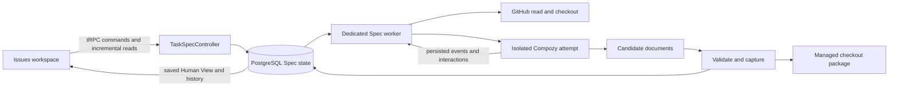

# Technical Specification: Route-driven Spec Execution with Compozy

## Executive Summary

Extend the existing Issues work item with a separate durable Spec workflow in `packages/api` and stage-specific Human Views in `apps/web`. Preserve confirmed Issue publication and approved planning as immutable inputs. A dedicated Flow Dev worker on a persistent Linux server automatically provisions isolated project checkouts, supervises Compozy 0.3 sessions, captures exact document revisions and applies explicit author commands. PostgreSQL owns application state and review history; Compozy owns actual agent execution. Dev Control retains its current planning responsibility.

The user selected server execution, automatic checkout preparation and an operator-managed agent account during technical clarification on 2026-10-05. ADRs 001–005 already fix the product scope. ADRs 006–010 resolve implementation choices. The design covers both routes through approved Tasks in this delivery. Principal trade-offs are a maintained separate-document skill bundle, an isolated execution host and recoverable coordination between database and filesystem. The implementation is **not integration-ready** until the real provider/runtime gates below pass; source inspection and a verified binary version are not proof of an interactive run.

## System Architecture

### Existing architecture and evidence

The inspected working tree contains Next.js 16.3.8, React 19.2.8, plain tRPC v11 clients, Zod 4, PostgreSQL 16, Drizzle, Vitest and Playwright. Much of the task/planning implementation is currently uncommitted. This specification targets those files as they exist, without claiming they are merged or deployed.

| Existing owner | Evidence and reuse |
| --- | --- |
| `packages/api/src/routers/taskPlanning.ts` and `controllers/taskPlanningController.ts` | Thin authenticated procedures; author checks; retained planning decision and selected route. |
| `application/services/tasks/planningContracts.ts` and `infra/database/schema/tasks/planning.ts` | Saved recommendation, selected route, uncertainty strings and approval provenance. |
| `infra/database/schema/tasks/boundaries.ts` | Confirmed publication snapshot and stable repository/Issue association. |
| `infra/database/dao/tasks/planningReceiptHelpers.ts`, `planningStart.ts`, `planningWorkerClaim.ts`, `planningWorkerSettlement.ts` | Request-key hashes, row locks, worker leases/fences and stale-result rejection. |
| `application/services/projects/repositoryAccessService.ts` | Stable repository validation and refreshed personal GitHub credentials. Public-repository reads can currently fall back to anonymous access; Spec deliberately requires connected personal credentials. |
| `cli/tasksWorker.ts` | Two awaited slots for generation/publication/planning; leave this pool independent of Spec. |
| `apps/web/src/features/issues/issue-composer/` | Existing workspace, author/reader stages, typed contracts, uncertain-command handling, polling, navigation and design primitives. |
| `packages/api/test/database.ts` | Disposable database harness with an explicit migration list; extend this list with the Spec migration. |

There is no existing Compozy adapter, checkout provisioner, Spec package persistence or interactive runtime channel. The old context broker rejects dot-prefixed paths and cannot serve `.compozy` artifacts unchanged. The old activity read caps results at 500; Spec uses its own paged history. The simple `MarkdownPreview` is insufficient for the new review contract.

### Component Overview

All new backend paths below are relative to `packages/api/src/`; resource paths are relative to `packages/api/`. Keep files within the repository's 100-line limit, functions within 30 lines, and split helpers by responsibility. Do not introduce a new package, generic DI framework or one-service-per-command hierarchy.

| Component | Owner and responsibility |
| --- | --- |
| Spec API | `routers/taskSpec.ts`, `schemas/spec*.ts`; `protectedProcedure`, schema, one controller call. Add `taskSpec` to the existing root router and preserve the type-only package export. |
| `TaskSpecController` | `controllers/taskSpecController.ts`; actor/project/repository/author checks, transaction orchestration through existing composition, safe transport errors and DTO mapping. |
| `SpecLifecycleService` | `application/services/spec/`; eligibility, commands, exact-version approval gates, retry and return-to-review rules. Pure helpers own route/state decisions. |
| `SpecInteractionService` | Same service context; question/permission validation, first-resolution arbitration, delivery state and orphan recovery. |
| `SpecCaptureService` | Same context; manifest validation, source interpretation, upstream integrity, prepare/install journal and review readiness. |
| `TaskSpecDao` | `application/database/dao/taskSpecDao.ts` and focused companion contracts; scoped transactional reads/writes. `infra/database/dao/spec/` contains Drizzle implementations. |
| `SpecWorkerController` | `controllers/specWorkerController.ts`, `cli/specWorker.ts`; admit attempts, dispatch/reconcile commands, ingest events, verify stop, finalize packages. No long database transaction around I/O. |
| `SpecRuntimeGateway` | `application/spec/specRuntimeGateway.ts`; implemented in `infra/spec/compozy/`. Narrow pinned protocol, schema validation, private transport, runtime identities and replay. |
| `SpecWorkspaceGateway` | `application/spec/specWorkspaceGateway.ts`; implemented in `infra/spec/workspace/`. Git checkout, isolated candidate workspace, per-stage write scope, manifest comparison and promotion. |
| `SpecDocumentModel` | `application/spec/documents/`; pure Markdown block, package-index, source coverage, decision, graph and test-ownership validation; `infra/spec/documents/` integrates parser libraries. |
| Managed skill bundle | `resources/spec/{prd,techspec,tasks}/SKILL.md`, shared templates and schema resources; versioned together with package metadata and compatibility fixtures. Follow the repository's skill-creator instructions when implementing these resources. |
| Spec UI | `apps/web/src/features/issues/issue-composer/spec/`; local components, hooks, copy, state and presentation helpers. Compose from existing author/reader stages; do not add a sibling feature that imports issue-composer internals. |



### Requirement allocation

| PRD source | Technical owner |
| --- | --- |
| Goal 1; Core Feature 1; US-001 | `specEligibility`, approved planning projection, `SpecProgress` and start command. |
| Goal 2; Core Feature 2; US-002 | Spec worker, workspace/runtime gateways, immutable `SpecInput`, managed skills. |
| Goal 3; Core Features 3–5; US-003–US-008 | Event normalizer, interaction service, document model, three Human Views. |
| Goal 4; artifact separation; US-006–US-008, US-013 | Pinned runtime and managed separate-document bundle; package validator. |
| Goal 5; Core Feature 6; US-010 | Approval command, verified installed manifest, immutable approval records, explicit next start. |
| Goal 6; Core Features 6–7; US-009, US-011–US-012 | Adjustment/retry/stop reconciliation, previous package pointer and return command. |
| Goal 7; Core Feature 8; US-013 | Version capture, promotion journal, protected checkout and absence of Git publication capabilities. |
| Goal 8; identity/lifecycle rules; US-014–US-015 | Scoped DAOs, personal repository access on every read/command, author gates, projection polling and attempt fencing. |

## Implementation Design

### Core Interfaces

These are application contracts; concrete DTOs remain inferred from tRPC return types. Store timestamps as `timestamptz`; serialize ISO strings. UUIDs identify Flow Dev entities, opaque strings identify runtime resources, and SHA-256 digests are lowercase hex strings.

```ts
export type SpecStage = "prd" | "tech_spec" | "tasks";
export type SpecInput = {
  taskId: string;
  projectId: string;
  stage: SpecStage;
  publicationId: string;
  planningDecisionId: string;
  selectedRoute: "prd" | "tech_spec";
  repositoryGithubId: string;
  commitSha: string;
  upstreamPackageIds: string[];
  decisionIds: string[];
  reviewedPackageId: string | null;
  adjustment: string | null;
  contextHash: string;
};
```

```ts
export interface SpecRuntimeGateway {
  preflight(input: RuntimeConfiguration): Promise<RuntimeCapabilities>;
  create(input: CreateRuntimeSession): Promise<RuntimeSession>;
  submit(input: SubmitSpecPrompt): Promise<RuntimeSubmission>;
  inspect(input: RuntimeIdentity): Promise<RuntimeSnapshot>;
  events(input: RuntimeCursor): AsyncIterable<RuntimeEvent>;
  interactions(input: RuntimeIdentity): Promise<RuntimeInteraction[]>;
  resolve(input: ResolveRuntimeInteraction): Promise<RuntimeResolution>;
  stop(input: RuntimeIdentity): Promise<RuntimeStop>;
}
```

```ts
export interface SpecWorkspaceGateway {
  prepare(input: PrepareSpecWorkspace): Promise<SpecWorkspace>;
  freeze(input: AttemptIdentity): Promise<CandidateManifest>;
  inspect(input: WorkspaceIdentity): Promise<InstalledManifest>;
  promote(input: PromoteSpecPackage): Promise<InstalledManifest>;
  verify(input: VerifySpecPackage): Promise<InstalledManifest>;
}
export type PackageIdentity = {
  packageId: string;
  manifestHash: string;
  stage: SpecStage;
};
```

```ts
export type SpecCommand = {
  projectId: string;
  taskId: string;
  requestKey: string;
  expectedSpecVersion: number;
};
export type SpecReceipt = {
  commandId: string;
  status: "accepted" | "applied" | "rejected" | "reconciling";
  specVersion: number;
  attemptId: string | null;
  packageId: string | null;
  reason: SpecReason | null;
};
```

```ts
export type ReviewBlock = {
  id: string;
  documentId: string;
  sourceHash: string;
  startByte: number;
  endByte: number;
  kind: "heading" | "prose" | "list" | "table" | "code" | "diagram";
  content: string;
};
export type ReviewDiagnostic = {
  code: string;
  severity: "blocking" | "observation";
  documentId: string | null;
  blockId: string | null;
  message: string;
};
```

The package index has an explicit versioned contract:

```ts
export type SpecPackageIndex = {
  schemaVersion: 1;
  stage: SpecStage;
  documents: IndexedDocument[];
  upstream: PackageIdentity[];
  stories: IndexedStory[];
  tests: IndexedTest[];
  tasks: IndexedTask[];
  decisions: IndexedDecision[];
};
```

| Index member | Required shape |
| --- | --- |
| `IndexedDocument` | `path`, `role`, `sha256`, `sourceBytes`; stage-required paths are checked independently. |
| Source reference | `documentPath`, `startByte`, `endByte`, `sourceHash`; range must match complete retained source and UTF-8 boundaries. |
| `IndexedStory` | `id`, `title`, source reference, acceptance IDs/source references, edge IDs/source references. |
| `IndexedTest` | `id`, `tier: task-required|feature-gate|qa-release`, source reference, referenced story/component IDs, `ownerTaskId` or `gateOwner`; only the applicable owner is populated. |
| `IndexedTask` | `id`, `title`, `path`, `dependsOn: string[]`, `testIds: string[]`, source references for scope and acceptance; IDs and decoded titles must match the task file. |
| `IndexedDecision` | `id`, `severity: blocking|observation`, `status: open|resolved`, source reference, optional resolution interaction ID; resolved decisions must identify their recorded answer or documented rationale. |

Unknown fields do not authorize behavior. Validate IDs, referenced existence, unique ownership, source hashes, stage membership and schema version. Empty story arrays are valid on the TechSpec-only route when no story catalog exists; required Issue/Spec coverage relationships still refer to their source sections rather than fabricated story IDs.

`RuntimeResolution` distinguishes `applied`, `answered`, `already_resolved`, `resolved_after_restart`, `queue_full`, `unknown` and `rejected`, retaining the winning value and whether live delivery was proven. `RuntimeStop` includes `state`, `verified`, `cause` and `attention`; only a verified terminal outcome settles an attempt. Runtime transport errors are plain typed application errors; controllers map them to the safe contract below. Preserve these types across transaction error wrappers. Never expose tokens, raw runtime objects, host paths or private model reasoning in DTOs.

### Data Models

Add focused schema files under `infra/database/schema/tasks/` and export them through the existing schema owner. Use a generated additive migration plus explicit SQL constraints/triggers. Do not change `tasks.status`, the old `task_operations` kinds, or immutable approved-planning triggers.

| Table | Fields and constraints |
| --- | --- |
| `task_spec_workflows` | `id uuid PK`, `task_id uuid UNIQUE`, `project_id uuid`, `author_user_id text`, `publication_id uuid`, `planning_decision_id uuid`, `selected_route text`, `version integer`, `current_stage text`, `state text`, `workspace_id uuid NULL`, created/updated timestamps. Route is `prd` or `tech_spec`; store no workflow row for unsupported continuation. FK associations must include task/project identity. |
| `task_spec_workspaces` | `id uuid`, `workflow_id uuid UNIQUE`, stable repository GitHub/node IDs, `base_commit text`, `runner_id text`, server-only checkout locator, `slug text UNIQUE`, `installed_manifest_hash text NULL`, `state text`, capacity/compatibility metadata. Slug is `flow-<full task UUID>`; existing unmanaged paths are conflicts. |
| `task_spec_stages` | `(workflow_id, stage) UNIQUE`, state, current attempt/package IDs, previous complete package ID, approved package ID, version integer. Route prerequisites enforced inside locked transactions. |
| `task_spec_attempts` | `id uuid`, workflow/stage, monotonically increasing attempt number, `kind generate|adjust|retry`, `source_attempt_id uuid NULL`, `input jsonb`, `input_hash text`, state, runtime workspace/session/turn IDs, prompt message/key, lease owner/fence/expiry, runtime cursor, terminal reason/timestamps. Partial unique index on workflow where state is queued/dispatching/running/waiting/finalizing/stopping/reconciling. |
| `task_spec_commands` | `id uuid`, workflow or task scope for initial start, action, actor ID, request key, canonical payload hash, expected version, immutable payload, attempt/package references, delivery status, safe reason, timestamps. Unique `(actor_user_id, request_key)`; a reused key with any different action/scope/payload is a conflict. Worker lease fields support asynchronous approval and response dispatch. |
| `task_spec_interactions` | Internal ID, attempt/session/turn/provider-request IDs, kind, full safe question or permission description, choices, target/action digest, status, winning command ID, author response, `delivery pending|delivered|orphaned|unknown|inactive`, timestamps. Unique runtime interaction identity. One winner selected under row lock; actor identity is server-derived. |
| `task_spec_events` | Internal UUID, workflow-local bigint sequence, attempt ID, runtime session/generation/sequence identity when applicable, kind, safe payload, observed/emitted timestamps. Unique provider identity; indexed `(workflow_id, sequence)`. Allocate workflow sequence under the same row lock as insertion so committed cursors cannot skip earlier uncommitted events. |
| `task_spec_packages` | ID, workflow/stage/attempt, revision integer, parent package ID, input package IDs, manifest hash, `partial|prepared|installed|review_ready` capture state, diagnostics, package index, diff summary, created timestamp. Unique `(attempt_id, manifest_hash)`. Content becomes immutable on capture; readiness/promotion metadata is separately versioned. |
| `task_spec_documents` | ID, package ID, relative path, role, UTF-8 source text, byte count, SHA-256, parsed source-linked blocks. Unique `(package_id, path)`; byte length constraint enforced at admission/capture. |
| `task_spec_approvals` | ID, workflow/stage, package ID/hash, approver ID, approved time, verified installed-manifest hash. Unique `(workflow_id, stage)`; immutable database trigger. |
| `task_spec_finalizations` | ID, command/attempt, source and target manifests, per-file expected/target hashes, durable install steps, verification timestamp, phase and failure reason. Only one pending finalization per workspace. |

Store blocking decisions in the package index with stable IDs, source references, status, origin interaction and any approved-input conflict. Carry planning uncertainty strings into the input verbatim; do not pretend they already have resolution or severity. The generated documents/index classify new decisions explicitly, and validators require consistent references. An unresolved blocking decision prevents approval; an observation remains visible without a fabricated resolution.

### Lifecycle and command consistency

The public stage states are `not_started`, `queued`, `running`, `waiting_question`, `waiting_permission`, `finalizing`, `review`, `stopping`, `failed`, `canceled`, `approved`. `reconciling` is a separate outcome-uncertainty flag so connection loss does not falsely change the execution state. `approving` is a pending command displayed over `review`, with competing mutations disabled.

| Transition | Preconditions and effect |
| --- | --- |
| Start | Confirmed publication, approved supported selected route, complete retained input, fresh author/repository access, configured healthy execution. Atomically create/locate workflow, receipt and one queued attempt. Never start on a query, planning approval or navigation. |
| Dispatch | Claim using lease/fence; prepare checkout and candidate; recheck access and input IDs; create session and persist its ID before sending an idempotent prompt. If session creation outcome is unknown, reconcile by exact attempt-derived name/workspace under the runner lock; do not prompt an unbound duplicate. |
| Runtime waiting | Persist question/permission and expose it independently of history. Human wait holds a runtime capacity slot, not a database job lease or old tasks-worker slot. No elapsed-time answer. |
| Answer/permission | Lock exact current interaction and reserve one winning command. Save the author choice before dispatch. Mark delivered only from runtime confirmation. `queue_full` stays pending and allows an explicit resend of the same command. Conflicting second submissions show the authoritative choice; no overwrite. |
| Runtime turn done | Check pending interactions, turn outcome and required outputs. A completed turn alone is not stage success. Freeze writes and enter finalizing only for the expected current attempt. |
| Review | Enter only after complete validated capture and installation. Generation/adjustment always returns to review. |
| Adjust | Require current unapproved review package/hash and nonblank change request. Preserve that complete package; create one new candidate attempt with the reviewed bytes and approved upstream input. |
| Approve | Reserve command against exact displayed current package/hash/version. Worker verifies canonical files under the workspace lock and rechecks authorization. In a short fenced transaction, insert immutable approval and mark stage approved. Release the next start action only; do not dispatch it. |
| Cancel | Queued undispatched attempts cancel transactionally. Dispatched attempts enter stopping, issue stop to their session and wait for verified settlement. A prior authoritative completion wins; a confirmed cancellation cannot be undone by a late result. |
| Retry | Only after confirmed failed/canceled state and no unresolved runtime/finalization. Create a new attempt/session using the same pinned base, approved packages, saved answers and applicable adjustment request. Old permissions are history, not grants. |
| Return to review | After a failed/canceled adjustment settles, explicitly reinstall the previous complete captured package using the same promotion journal and drift checks. Mark it current review, never approved. Preserve failed proposal history. |

Every mutation first checks actor access, then looks for an existing receipt, then checks optimistic version and state under row locks. A matching accepted receipt survives stale expected versions and is replayed only to a currently authorized actor. Different request keys racing on one state yield one attempt/approval and a `spec_conflict` for the loser, which refreshes to the winner. Maintain `specVersion` separately from authoring task version; update the lightweight task summary invalidation when Spec changes.

Use a 30-second worker job lease, 10-second heartbeat and incrementing execution fence. Recovery reclaims only expired **supervisor jobs**, never assumes the provider stopped. Check runtime session/turn and saved cursor before another side effect. A process restart reconnects to the same private runtime endpoint; losing that endpoint triggers explicit reconciliation. An orphaned answer can be retained as a decision but is labeled not delivered. Settle/stop the lost turn before an explicit retry supplies saved answers to a fresh session.

Author access loss requests system-initiated verified stop with `access_revoked`; it never answers a question or transfers authorship. Browser session expiry blocks that browser's actions/delivery but does not by itself revoke the author's still-valid project/repository entitlement. Revalidate author entitlement before dispatch, interaction delivery, capture, approval and every 30 seconds during active execution. Network failure while checking access suspends further side effects and reconciles; it is not proof of revocation.

### API Endpoints

Reuse `/api/trpc` and the existing same-origin/session/no-store policy. Read operations are tRPC queries (GET); commands are mutations (POST). Never accept user ID, repository URL, filesystem path, runtime session ID or provider command from browser input. All calls carry `{projectId, taskId}`. UUID validation rejects malformed associations before lookup.

| Procedure | Additional input | Success |
| --- | --- | --- |
| `taskSpec.byTask` | None | Current state, route, permissions/blockers, pending interactions, package metadata, `specVersion`, latest event cursor; no full history. Not-started is a valid empty result. |
| `taskSpec.events` | `after?` or `before?`, `limit` 1–100, default 50 | Scoped ascending page, next cursor, `hasMore`; mutually exclusive cursors. Cursor carries scope and direction and is signed. |
| `taskSpec.event` | `eventId` | Full saved safe detail for one scoped event, up to 1 MiB, plus explicit provider omission metadata. |
| `taskSpec.packages` | signed cursor, `limit` 1–50, default 20 | Revision metadata and capture/approval status; no source body. |
| `taskSpec.package` | `packageId` | Manifest, section index, relations, decisions, diagnostics, actual diff and included document identities. |
| `taskSpec.document` | `packageId`, `documentId`, optional block cursor, `limit` 1–100 | Full untruncated source or paged blocks, hash, total count, next cursor. Source mode returns one bounded document as inert text. |
| `taskSpec.submission` | `action`, `requestKey` | `unknown` when no receipt exists, otherwise the saved receipt; author-only. Query never dispatches. |
| `taskSpec.start` | Command fields and `stage` | Accepted `SpecReceipt`; an unsupported selected route is blocked, never substituted. |
| `taskSpec.adjust` | Command fields, `stage`, `packageId`, `manifestHash`, `text` | Accepted receipt and one new adjustment attempt. |
| `taskSpec.answer` | Command fields, `attemptId`, `interactionId`, `{choiceIndex}` or `{text}` | Accepted receipt; delivery remains pending until confirmed. |
| `taskSpec.permission` | Command fields, `attemptId`, `interactionId`, `actionDigest`, `decision: allow_once|deny_once` | Accepted receipt; allow is impossible for an out-of-scope action. |
| `taskSpec.cancel` | Command fields, `attemptId` | Stopping receipt or existing terminal result. |
| `taskSpec.retry` | Command fields, `failedAttemptId` | Accepted receipt for one new attempt. |
| `taskSpec.returnToReview` | Command fields, `failedAttemptId`, `packageId`, `manifestHash` | Accepted restore command; review returns only after file verification. |
| `taskSpec.approve` | Command fields, `stage`, `packageId`, `manifestHash` | Accepted approval command, later applied receipt with approver/time; never an implicit next run. |

`requestKey` is UUID. `expectedSpecVersion` is a nonnegative integer; the first start uses 0. Answer text and adjustment text allow 1–16,384 UTF-8 bytes after nonblank validation. Choice index must address the exact saved offered array; it is never inferred from a label or preselected control. `manifestHash` is 64 lowercase hexadecimal characters. Omit unsupported fields rather than passing them to a generic shell/prompt API.

Shared failure shapes use `{data.code, data.reason, data.retryAfterSeconds?}` through the existing safe error formatter, with pt-BR user messages. Specific reasons are part of the inferred schema, not substring matching.

| tRPC code / HTTP status | Reasons and scope |
| --- | --- |
| `UNAUTHORIZED` / 401 | `session_required`: all procedures. |
| `NOT_FOUND` / 404 | `spec_unavailable`: hidden/missing project, task or nested resource; every scoped procedure. No foreign-resource disclosure. |
| `FORBIDDEN` / 403 | `author_required`: mutations and submission; `access_revoked`: previously visible scope now denied. |
| `PRECONDITION_FAILED` / 412 | `repository_authorization_needed`: all content and commands; `planning_required`, `publication_required`, `stage_prerequisite`, `route_unsupported`, `package_incomplete`, `decision_blocked`, `workspace_unavailable`, `runtime_incompatible`, `runtime_unconfigured`, `permission_out_of_scope`: commands where relevant. |
| `CONFLICT` / 409 | `spec_conflict`, `request_key_reused`, `attempt_active`, `outcome_unknown`, `interaction_stale`, `interaction_resolved`, `artifact_conflict`, `stage_approved`: relevant mutation. |
| `BAD_REQUEST` / 400 | `invalid_input`, `invalid_cursor`, `invalid_answer`, `invalid_permission`: schema or association shape; stale valid associations use conflict, foreign associations use 404. |
| `TOO_MANY_REQUESTS` / 429 | `spec_capacity`, `provider_rate_limited`, `interaction_queue_full`; do not claim a new generation or delivered answer. Preserve an already accepted command for reconciliation. |
| `INTERNAL_SERVER_ERROR` / 500 | `service_unavailable`: unexpected DB/I/O failure or unavailable read dependency, safe message only. No mutation success may be inferred from this response. |

Asynchronous attempt/command reasons additionally include `context_limit`, `package_limit`, `artifact_invalid`, `capture_failed`, `runtime_failed`, `runtime_incompatible`, `access_revoked`, `resource_limit`, `provider_rate_limited`, `artifact_conflict` and `outcome_unknown`; these retain saved context and the actual delivery/terminal state. An asynchronous failure after command acceptance is represented in the saved receipt/attempt with a safe reason, not a retroactive HTTP result. `submission=unknown` permits resending the **same** key/payload; it never authorizes generating a different key while the outcome may exist.

### Workspace, isolation and artifact consistency

The execution supervisor manages `<SPEC_WORKSPACE_ROOT>/<repositoryGithubId>/<taskId>/checkout` and attempt staging directories outside the user checkout. Use argument-array subprocess execution with no shell interpolation. Git remote URLs are derived from verified GitHub metadata, not agent/browser input. Resolve repository identity before and after clone, disable hooks and submodule recursion, skip LFS smudge, and pin the resolved base SHA. Secret files such as `.env*`, credential files and unrelated generated caches are excluded from the agent-visible mount; retained requirements are never silently trimmed to fit context.

Pass the author's temporary Git credential only through a short-lived supervisor credential helper/pipe. Never place it in URL, argv, Git config, runtime environment or logs. A separate operator provider account is configured in the isolated execution environment; no personal Codex/Claude home directory is mounted. The managed provider account has only the intended model-service access. Model/provider identity is an operator setting validated at preflight, not a new user-account integration in this delivery.

Use rootless Podman as the execution host's OCI runner. Each attempt gets a private container, runtime data volume and local control socket. No host container socket, database network access, host home or other workspace is mounted. Drop capabilities, disallow privilege escalation, apply CPU/memory/process/storage quotas and read-only root filesystem. Only current-stage candidate outputs and private runtime scratch are writable. Agent tools can read the pinned project and approved inputs but cannot mutate implementation or Git metadata. Allow egress only to the configured provider and an operator-configured documentation GET proxy; deny GitHub write APIs, arbitrary external writes and host-local services. Document lookup outside the allowlist becomes a scoped denied/permission request, never unrestricted network access.

Set the managed agent permission mode explicitly to `approve-reads`, verify the resolved policy during preflight, and disable autonomous background workflows, external MCP integrations and cross-workspace grants in the isolated runtime. `allow-always`/session-wide grants are never offered or accepted by Flow Dev. The sandbox independently rejects implementation, publication and out-of-scope file access even when the provider misclassifies an operation.

Use the daemon's local HTTP protocol over its private Unix socket, reachable only by the supervisor and the attempt container. Do not expose an unauthenticated daemon listener to the network. The pinned OpenAPI declares no `securitySchemes`; do not invent a Bearer header as authentication. Validate actual UDS/socket ownership during the runtime gate. Container runtime isolation remains authoritative even if an agent attempts to use the daemon's own tools or an author approves an excessive permission.

Maintain a per-workspace supervisor lock and a fenced database lease. Before an attempt, construct a candidate view containing exact approved upstream files and any prior current-stage complete package. Every stage also writes its own stage-qualified `.flow-spec-<stage>.json` index. Only the current stage's paths can change: PRD writes `_prd.md`, `_user_stories.md` and newly allocated ADR files; TechSpec writes `_techspec.md`, `_tests.md` and new ADRs; Tasks writes `_tasks.md`, indexed `task_NN.md` files and its package index. Existing ADRs are immutable inputs. New ADR numbers are reserved under the workspace lock; no stage overwrites an upstream ADR.

The supervisor captures an internal `.flow-spec-<stage>.json` index as part of the package but displays substantive Markdown as primary content. The index includes schema version, document roles/hashes, source-linked story/test/task IDs, dependency edges, test execution tiers/owners, decisions and upstream package hashes. Validate every referenced path and byte span against actual files; do not trust a model-supplied hash or relationship without comparison. Record the generated index and the independently computed manifest separately.

Finalization is recoverable, not a claimed cross-system transaction:

1. Verify actual provider settlement, freeze candidate writes, acquire the workspace lock and recheck current attempt/fence/access/upstream hashes.
2. Read bounded regular UTF-8 files; reject symlinks/hardlinks, traversal, duplicate/case-colliding paths, unexpected output and changed approved inputs. Save valid partial evidence even when the complete package fails validation.
3. Parse every source block and validate required companions, decisions, graph, references and test ownership. Capture immutable documents/index/manifest in a transaction with journal phase `prepared`.
4. Compare canonical files with the last installed manifest. For each changed file, write a same-filesystem temp file, fsync and atomically rename only when expected prior hash matches. Journal each step; retain removed task files in captured history and remove from the canonical current package only under the same expected-hash rule. Fsync the containing directory. Readers use database snapshots throughout.
5. Verify every installed hash; transactionally mark installed and current review-ready using the current fence. On crash, match files to old/new per-file hashes and finish idempotently. Any third-party hash produces `artifact_conflict`; do not overwrite it.

Each stage package owns its required documents, newly added ADRs and stage-qualified index; approved upstream packages are immutable referenced packages, not mutable copies. The installed workspace manifest is the union of those stage manifests. Full stage manifest hash covers normalized sorted path/role/byte-hash entries, stage, bundle/schema versions and exact upstream identities. Preserve source bytes; line-ending changes are real revisions. Approval re-verifies this manifest and every required file. A detected external edit makes the checkout conflicted while saved approvals remain inspectable. Recovery requires an operator to preserve the external copy and restore the expected bytes, followed by author refresh/retry; this feature has no force-overwrite or import-external-as-approved control. Source commit drift never silently repins a workflow.

### Human View and client behavior

Extend `AuthorStage`, `ReaderStage`, `PlanningActions`, `planningModel`, workspace contract/loading and task-summary invalidation. Keep existing Issue/planning history intact. New owned modules live under `issue-composer/spec/`, including `SpecStage`, `SpecProgress`, `SpecActivity`, `SpecInteraction`, `PrdReview`, `TechSpecReview`, `TasksReview`, `SpecChanges`, `SpecReviewActions`, `useSpecSnapshot`, `useSpecCommand` and their small helpers. Do not move unrelated features. Preserve `/projects/{projectId}/issues/{taskId}` as the entry URL. Optional `specStage`, `specPackage` and `specDocument` query parameters select review content only; decode them in the thin route loader and validate scope through tRPC. A future-stage link shows the unmet prerequisite and actual current stage without dispatch. Use inferred `RouterInputs`/`RouterOutputs`; server loading continues through the existing cached server caller.

Use `mdast-util-from-markdown` with GFM extensions for deterministic backend parsing; pin actual versions in the lockfile during implementation. Do not hand-parse rich Markdown with the old preview regexes. The document helpers are `parseSpecDocuments`, `validateSpecPackage`, `validateSpecGraph`, `validateTestOwnership`, `specPackageDiff` and `safeSpecLink`. Lifecycle/client helpers are `specEligibility`, `specTransition`, `normalizeSpecEvent`, `reduceSpecEvents` and `specApprovalGate`. Every material source block is represented or listed as a blocking interpretation gap. Preserve unknown safe headings and their complete content under additional sections. Empty optional sections have honest empty states; missing required companions block review. Link handling permits safe HTTPS references and resolves package-relative links only to captured authorized document IDs; disallow JavaScript, data/file URLs, raw HTML and automatic external image loading.

PRD review groups problem/outcome/scope/rules and links personas/stories/acceptance/edges/ADRs by source IDs. TechSpec review groups components/contracts/data/integrations/risks and links the **planned** test contract by story/component/test IDs. Tasks review uses a pageable task list with an optional dependency view; every task retains full scope, acceptance and assigned validation. Validate duplicate IDs, absent files, missing dependency targets, cycles and test ownership before review readiness. Each `task-required` test has exactly one implementation task owner; `feature-gate` and `qa-release` tests each have one explicit gate owner/reference. Contradictory owners or missing tier information block approval. Never equate a task checkbox, generated report or test plan with executed evidence.

Render code as escaped inert text and tables with accessible headers and horizontal overflow. Lazy-load Mermaid for supported diagrams with strict security settings; sanitize generated SVG with DOMPurify and place it in a sandboxed frame without script/network execution. Provide a text explanation and complete source. A failed/unsupported material diagram is an explicit blocking interpretation gap, not a silently omitted block. No generated script, HTML handler or executable snippet runs.

Diffs compare captured block/source content, not a model-authored summary. Identify added/removed/changed sections and documents, allow full old/new comparison, and label any agent commentary as commentary. Keep stage/current version/pending action visible above paged history. Preserve focused inputs and scroll position when unrelated activity arrives. Announce lifecycle and required-action changes with a polite live region, not every text chunk. Use pt-BR controls and existing tokens, approval green, 40px actions, keyboard focus, light/dark modes and reduced motion.

`useSpecSnapshot` polls one incremental page at a time, drains `hasMore` immediately, deduplicates by event ID and never replaces a newer snapshot with an older response. Poll every 1 second during queued/running/finalizing/stopping/reconciling; every 5 seconds during waiting/review; every 30 seconds after approval/failure/cancellation. Pause while hidden and refresh on visibility/focus/online. Current pending interactions and state come from `byTask`, independent of how much historical activity is loaded. Failed polls display loss of contact and retain authorized last-known facts; denial clears protected caches and stops polling.

Keep request identities/payloads for uncertain commands in the existing session-scoped pending-command pattern, keyed by user/project/task/action; clear on logout/access loss. No automatic resend of permission grants or answers after identity changes. Disable approval locally for unsent adjustment text, active generation, pending response, uncertain submission or stale viewed revision. The server enforces all durable gates; local unsent text is a client-only gate and cannot be inferred from another tab. Reopening a workflow or viewing an artifact remains read-only.

## Integration Points

### Pinned Compozy protocol and evidence

Inspected on 2026-10-05: release `v0.3.0-beta.29` (release commit short ID `f0c134a`), the tagged OpenAPI, and both tagged upstream skills. Downloaded the Linux x86_64 binary to `/tmp`, verified release checksum `fd165c8af59e6d9ba1abc2d96aff9b43d72dd19b6e49572b0431d05937d34232`, and executed `version` and command help successfully. OpenAPI SHA-256 is `dc90a4565fbdf37fe10afcbfd8398f585f7d21211591a814ee84e2b9f7cd91a6`. No daemon, provider-authenticated session, adapted skill generation or production integration was exercised during this design.

| Adapter operation | Tagged external contract |
| --- | --- |
| Register workspace | `POST /api/workspaces`, `{root_dir, name, default_agent}`; root chosen by supervisor. |
| Create session | `POST /api/sessions`, `{workspace, agent_name, name}`; returns 201. No documented caller idempotency key here: reconcile uncertain creation before another create/prompt. |
| Submit prompt | `POST /api/workspaces/{w}/sessions/{s}/prompt`, `{message_id, idempotency_key, message, runtime?}`. Persist both IDs before dispatch; 200/202 acceptance, 409 conflict/indeterminate, 413 queue full. No new IDs on uncertain retry. |
| Observe | `GET .../sessions/{s}`, `GET .../events`, `GET .../stream?frames=raw`; persisted raw stream resumes by `Last-Event-ID`. Use runtime generation/session identity and a separate Flow Dev projection cursor. |
| List interactions | `GET .../interactions`; tagged fields include interaction/provider request/turn IDs, kind, status, title, choices/decisions and resolution. |
| Answer | `POST .../clarifications/{request_id}/answer`, `{choice_index}` or `{text}`. Tagged 200 shape is `{choice, fallback, text}`, not a generic `outcome` envelope. Reconcile the interaction record after response to establish delivery semantics. |
| Permission | `POST .../approve`, `{request_id, turn_id, decision}`. Tagged response includes `outcome`, `decision`, `request_id`, optional winning resolution. Map only allow-once/reject-once; reject broader grants. |
| Stop | `POST .../stop`, `{wait:false}`. 202 is stopping, not stopped; inspect until `verified` and terminal cause are proven. No missing-session assumption of cancellation. |

The live website can describe a different contract revision; use the tagged source as the adapter input. Normalize `applied`, `answered`, `already-resolved`, `resolved-after-restart` and `queue-full` only when actually observed in the pinned operation or reconciled interaction record. Unknown outcomes become `outcome_unknown`. Reject malformed/empty permission targets rather than offering generic approval. A denied permission shows the actual subsequent runtime state; runtime policy timeout is a runtime denial/failure with system attribution, never a human decision.

Ingest only allowlisted public `agent_message`, tool metadata/results with safe source references, interaction, lifecycle and warning information. Drop `thought`, raw provider envelopes, authorization headers, absolute host paths and secret values before persistence. Record omitted provider detail explicitly. Correlate tool start/result by tool-call ID; duplicates do not produce extra rows. Do not interpret `done` as artifact completion. Detect gaps/reset/degraded stream markers, recover the missing range from the pinned replay contract, and keep `reconciling` if the provider cannot supply it; a newest-N events query cannot prove a gap is filled.

### Separate-document bundle and release gate

The managed skills inherit the route, exact upstream packages, repository evidence, author answers, change request and hard write scope. They ask only unresolved consequential questions through the Compozy clarification channel. They emit documents plus the source-linked index, stop at the current stage and never start the next skill themselves. Their completion requirements include companion documents, source coverage, blocking decisions and tasks/test ownership. Repository instructions remain contextual constraints, never authority to bypass the execution sandbox or expand publication scope.

Before feature enablement, the implementation owner must record a real isolated compatibility report containing pinned binary/provider/model/bundle identities; workspace/session IDs; sanitized event/interaction samples; separate-document outputs for both routes; answer/permission delivery; daemon restart/orphan behavior; replay gap handling; cancel verification; and read-only mount/egress enforcement. Capability failure blocks enablement and keeps UI saved data readable. No mock, renamed unified file or deprecated runtime fulfills this gate. Provider/account/model is deliberately operator configuration; real credentials are a deployment dependency, not assumed available in this design session.

### GitHub and access

Reuse current project and personal repository authorization services. For Spec, call credential resolution and explicitly reject an empty personal credential even for public repositories. Never let admin visibility bypass this check or authorship. Git provisioning performs reads only. `tasks.status=published` and approved planning remain retained facts when the remote Issue title/status changes. Stable repository identity mismatch or inaccessible pinned commit blocks generation; it does not silently switch repositories. No Spec procedure uses the publication gateway, Ready/backlog placement, Issue edit/comment or PR endpoints.

## Impact Analysis

| Component | Impact Type | Description and Risk | Required Action |
| --- | --- | --- | --- |
| Spec schema/DAOs | new | High: concurrent command and approval integrity. | Add isolated tables, constraints, indexes, immutable records, migration/harness registration. |
| API root/composition/error formatter | modified | Medium: export and error-shape drift. | Register taskSpec, preserve old procedures, add safe reason enum and server-only dependencies. |
| Dedicated Spec worker and deployment | new | High: runtime, isolation and recovery. | New worker script, rootless runtime/volume configuration, compatibility report and health checks. |
| Repository credential integration | modified locally | High: private code/token exposure and public-read policy difference. | Reuse refreshed credentials; enforce personal authorization only at Spec boundary; test public/private readers. |
| Existing tasks worker/planning | retained | Medium regression risk if coupled. | No new blocking session dispatch in old slots; preserve publication/planning triggers and behavior. |
| Managed skills/parser/capture | new | High: missing scope or incorrect review representation. | Versioned contracts, bounded source capture, graph/coverage validation, safe rendering. |
| Issue-composer author/reader stages | modified | Medium: navigation, command uncertainty and long documents. | Compose local Spec subtree, lightweight summary updates, stage-specific views and accessible controls. |
| `PRODUCT.md` / `DESIGN.md` | modified during implementation | Old final-planning/no-execution boundary conflicts with this PRD. | Update only the affected journey and stage patterns, preserving tokens and explicit approval. |
| Package dependencies | modified during implementation | Parser/diagram/container tooling adds maintenance. | Pin required parser/rendering dependencies; lazy-load diagram code; no parallel tRPC client. |

## Testing Approach

`_tests.md` owns all concrete cases and stable IDs. Unit tests use Vitest for pure lifecycle, reducers, validation and presentation; fake only I/O gateways/clock. Controller/router integration uses real application wiring. PostgreSQL suites use the existing disposable database harness, real constraints and concurrent connections. Filesystem integration uses temporary repositories and real capture/promotion with crash injection at journal boundaries. HTTP runtime fixtures model the tagged external contract; they are distinct from a real pinned-daemon/provider gate.

Playwright journeys go through existing Issues URLs and accessible roles/labels with isolated user/project fixtures; no production accounts or production mutation. Focused Chromium journeys form the feature gate. Extended narrow-screen, keyboard, contrast, reduced-motion, multiple-browser, load and live-provider runs are QA/release gates. Fixture documents use exact separate packages, malformed companions, unknown blocks, task cycles, gaps and large content; never assert CSS internals or fabricated agent success.

Existing commands: `pnpm --dir packages/api test`, `pnpm --dir packages/api test:integration` with disposable `TEST_DATABASE_URL`, `pnpm --dir apps/web test`, `pnpm --dir apps/web test:e2e`, `pnpm lint`, `pnpm typecheck`, `pnpm build`. Add scoped Spec runtime scripts/configuration during implementation so provider gates are opt-in and cannot be mistaken for ordinary fixture tests. Missing credentials or host isolation mark that gate unverified, not passed. No application test run is claimed by this documentation task.

## Development Sequencing

### Build Order

1. Establish the pinned runtime/container/provider and adapted bundle compatibility in an isolated harness, including a real question/permission/stop cycle and both artifact routes. Capture evidence; resolve any contract difference before implementation depends on it.
2. Add application contracts, additive schema, receipts, lifecycle/route rules and scoped DAOs. Preserve previous workflow invariants.
3. Build authorized checkout provisioning, isolated runtime supervision and lightweight reconciliation jobs with leases/fences.
4. Implement event/interaction ingestion, author responses, stop and retry/orphan recovery; expose coherent tRPC reads/commands.
5. Implement complete artifact interpretation, integrity/graph/test validation, capture/promotion journal, exact-version approval, adjustment and return-to-review.
6. Integrate stage progression, live activity, interaction controls and all three Human Views into author/reader workspaces. Deliver the entire accepted flow; this order does not defer scope into later phases.
7. Run feature and provider gates, refresh product/design documentation, exercise deployment recovery/backup, and enable only compatible configured runners.

### Technical Dependencies

A persistent Linux host with rootless Podman and storage is required. The host needs the pinned Compozy release, authenticated operator provider/account/model, managed bundle, outbound provider/documentation access, GitHub read access and PostgreSQL connectivity for the supervisor. Web workers never need runtime or Git credentials. Current repository authoring/publication/planning changes must remain present because the design consumes their contracts.

Add `spec:worker` (`tsx src/cli/specWorker.ts`) to the API package. The supervisor requires `SPEC_ENABLED`, `SPEC_RUNNER_ID`, `SPEC_WORKSPACE_ROOT`, `SPEC_RUNTIME_IMAGE` (immutable image digest), the verified binary/bundle digests, `SPEC_PROVIDER`, `SPEC_MODEL`, `SPEC_PROVIDER_ACCOUNT_REF`, `SPEC_DOCS_PROXY_URL` and existing supervisor database/credential-encryption configuration. Store numeric limits in a typed validated configuration module with the defaults above. The account reference identifies an operator secret provision, never its secret value. Refuse enabled startup on missing roots, mismatched digests, missing provider credentials or unenforceable isolation. No browser `NEXT_PUBLIC_` variable carries runtime configuration.

No infrastructure was installed globally by this design task. The binary/source inspections are recorded above. Provider-native behavior, exact socket permissions, container authentication and separate-document output compatibility are explicit implementation/release blockers until exercised; no unresolved product decision is hidden behind them.

## Monitoring and Observability

Emit structured events for command accepted/replayed/rejected, dispatch uncertain, runtime bound, interaction pending/delivered/orphaned, stop requested/verified/unverified, capture prepared/installed/conflicted, approval applied and access revoked. Fields: request/command/workflow/task/project/stage/attempt IDs, fence, safe reason, package hash, provider/runtime/bundle version and durations actually measured. Never log source bodies, secrets or private model reasoning by default.

Measure queue age, active/waiting capacity, reconciliation age, runtime replay lag, interaction delivery lag, finalization duration/conflicts, stale-fence rejections and authorized read latency. Alert on any isolation violation, any digest mismatch of an approved input, uncertain stop longer than 60 seconds, finalization older than 60 seconds, replay gap older than 30 seconds or disk free space below 20%. Waiting for a person is not an error alert. Alert the deployment operator through existing operations tooling; this feature introduces no notification integration.

## Technical Considerations

### Limits and performance budgets

These are explicit initial engineering defaults, not measured capacity claims. Configure named constants/server settings; report exceeded limits without truncating material. Recheck admission and display supported limits before accepting oversized commands.

| Resource | Default and behavior |
| --- | --- |
| Runtime admission | 2 concurrent attempts per runner, including human-waiting sessions; 20 queued attempts. Full queue returns `spec_capacity`; existing work remains inspectable/cancelable. |
| Container | 2 vCPU, 4 GiB memory, 256 processes and 2 GiB candidate/scratch quota per attempt; preflight requires capacity for configured slots. Resource termination is a visible failed attempt after verification. |
| Checkout | 5 GiB maximum materialized checkout, 120-second Git fetch/provision budget; no automatic submodule/LFS fetch. Missing needed submodule/LFS evidence is explicit and blocks affected decisions. |
| Commands | 16 KiB UTF-8 answer/adjustment, nonblank; API request body ceiling remains compatible with existing transport and is at least 64 KiB for Spec commands. |
| Initial context | 256 KiB assembled prompt; larger approved inputs stay referenced as complete read-only documents, never shortened silently. If required inline context still exceeds the bound, reject with a visible context-limit failure. |
| Package | 1 MiB per document, 8 MiB total source bytes, 256 files, 200 task files, 4,096 test IDs; exceeding any bound gives `package_limit` and preserves the last complete version. |
| Activity | 16 KiB preview, up to 1 MiB safe full message/detail, 64 MiB saved projection per attempt. Beyond the bound show omission/capacity reason and stop safely if required interaction/history fidelity cannot be maintained. Never truncate a question then accept an answer to hidden content. |
| Read pages | Events 50/default, 100/max; packages 20/default, 50/max; document blocks 100/max. Independent current state is always bounded. |
| Runtime HTTP/control | 10-second control request timeout. Uncertain mutation is reconciled, not retried with new identity. Reconnect backoff 1–30 seconds with jitter; no human-response deadline owned by Flow Dev. |
| Active-work watchdog | 2 hours of non-human-waiting execution, then verified stop with a resource-limit reason. Provider-specific waiting/permission timeouts remain visible system outcomes. |
| Capture | 60-second budget before surfacing delayed finalization; preserve journal and reconcile rather than assuming failure or enabling another attempt. |
| Retention | Full captured packages/approvals/answers/events for work-item lifetime; no automatic application-history pruning. Private runtime diagnostics 30 days after successful capture; clean orphan scratch only after proven stop and retained evidence. |
| Performance proof | With two active attempts and twenty readers, target p95 command acceptance below 1 second excluding an external access-service outage, p95 persisted-event visibility below 2 seconds in active views and package-index response below 1 second for maximum supported metadata. Record failures and tune before release; do not advertise these as measured facts. |

Back up PostgreSQL plus canonical checkout/runtime journals consistently. A restore first disables admission, reconciles installed manifests and verifies surviving runtime sessions, then re-enables. Never rebuild an approval from files alone. Rollout is additive: migrate, deploy disabled worker/API/UI, pass capability gates, enable the runner. Rollback disables new dispatch and drains/stops existing work with verified outcomes; keep Spec tables and artifacts so historical review survives. Do not apply a destructive schema downgrade to erase accepted work.

### Key Decisions

The user resolved topology, checkout automation and provider credential ownership. Existing PRD/ADRs resolve route, stages, document separation, approval and Git publication. Engineering decisions select dedicated Spec persistence/jobs, private pinned runtime sessions, incremental tRPC polling, PostgreSQL text snapshots, fenced file promotion, full source-linked parsing and rootless container isolation. No additional ritual question was needed for these choices; their alternatives and trade-offs are recorded in ADRs 006–010.

### Known Risks

- Beta runtime/API and provider behavior may differ from published docs. Pin all identities and require a real capability report; unknown outcomes block execution instead of becoming success.
- Session creation lacks the prompt's explicit idempotency fields. Use an attempt-specific private runtime and name, reconcile catalog state under a runner lock, and keep uncertain state when uniqueness cannot be proved.
- Rootless container filesystem/network enforcement and provider authentication may require host configuration. Treat their successful exercise as a prerequisite, not a prompt instruction.
- Source-linked indexes can still contain incorrect semantics. Preserve every document block, validate relations, expose conflicts and keep author approval decisive; never let a generated summary define scope.
- Disk/database failures can leave prepared or partly installed packages. The promotion journal and immutable captured bytes allow recovery; third-party changes remain explicit conflicts.
- Personal repository checks on repeated reads can hit provider limits. Reuse the existing authorization boundary carefully, stop protected delivery on uncertain access and measure read load; do not bypass checks to meet latency targets.
- Managed checkouts are local retained artifacts, not remote publication. Disk loss without coordinated backups loses checkout continuity even when database snapshots remain readable.

## Architecture Decision Records

- [ADR-001: Follow the approved planning route through Spec and Tasks](adrs/adr-001.md) — Accepted route and delivery boundary.
- [ADR-002: Keep separate PRD and Tech Spec documents on Compozy 0.3](adrs/adr-002.md) — Mandatory runtime and artifact contract.
- [ADR-003: Review every stage through a Human View and request changes from the agent](adrs/adr-003.md) — Review and approval model.
- [ADR-004: Preserve context across interactive runs, cancellation, and retry](adrs/adr-004.md) — Durable supervision.
- [ADR-005: Keep repository artifacts and the Flow Dev review synchronized without Git publication](adrs/adr-005.md) — Destination and integrity.
- [ADR-006: Run a dedicated Flow Dev worker with automatically provisioned isolated checkouts](adrs/adr-006.md) — Topology, authorization and isolation.
- [ADR-007: Pin Compozy and maintain separate-document workflow contracts](adrs/adr-007.md) — Adapter, bundle and compatibility gate.
- [ADR-008: Persist a separate Spec lifecycle and deliver a cursor-based live projection](adrs/adr-008.md) — Durable commands and real-time observation.
- [ADR-009: Capture immutable document packages with recoverable filesystem promotion](adrs/adr-009.md) — Exact-byte review and recovery.
- [ADR-010: Build faithful stage-specific Human Views from a validated document model](adrs/adr-010.md) — Lossless inspection and safe rendering.

## Source References

- [Pinned Compozy release](https://github.com/compozy/compozy/releases/tag/v0.3.0-beta.29) — Release identity and removal of the former managed Sandbox; host isolation belongs to this design.
- [Tagged OpenAPI](https://github.com/compozy/compozy/blob/v0.3.0-beta.29/openapi/compozy.json) — Exact inspected paths/request/response schemas.
- [Tagged create-spec](https://github.com/compozy/compozy/blob/v0.3.0-beta.29/extensions/spec-cycle/skills/cy-create-spec/SKILL.md) and [tagged create-tasks](https://github.com/compozy/compozy/blob/v0.3.0-beta.29/extensions/spec-cycle/skills/cy-create-tasks/SKILL.md) — Unified upstream contract requiring adaptation.
- [Compozy sessions](https://www.compozy.com/docs/sessions/), [events](https://www.compozy.com/docs/sessions/events/), [permissions](https://www.compozy.com/docs/sessions/permissions/) and [lifecycle](https://www.compozy.com/docs/sessions/lifecycle/) — Discovery references; verify against the pinned runtime before relying on behavior.
- [Markdown parser](https://github.com/syntax-tree/mdast-util-from-markdown), [Mermaid usage](https://mermaid.js.org/config/usage.html), [Podman run](https://docs.podman.io/en/latest/markdown/podman-run.1.html) — Proposed parser/rendering/host primitives; implementation owns pinned versions and verification.
