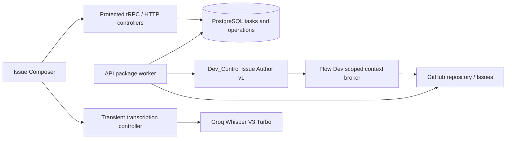

# TechSpec: Task Creation Through GitHub Publication

## Executive Summary

Implement the complete scope of the PRD's **Core Features** in the existing Next.js application and API package. Replace the simulated Issue Composer with shared, authorized PostgreSQL task history, immutable draft revisions, durable generation/publication operations, real repository evidence and reviewed GitHub creation. Keep the existing Issue Author in Dev_Control behind a versioned service API. Its tools use a Flow Dev context broker bound to one persisted operation, so GitHub tokens and current access rules remain inside Flow Dev. Use Groq `whisper-large-v3-turbo` for post-capture transcription, as explicitly selected by the user on 2026-10-01.

Use existing Drizzle, tRPC, OAuth and frontend ownership patterns. A PostgreSQL-backed worker provides restart recovery without Redis or another package. Request keys and optimistic versions prevent duplicate local actions. Publication dispatch has a separate durable fence: a potentially successful GitHub request is never blindly resent. Inconclusive recovery remains blocked, as the PRD explicitly requires. Final agent activity delivery and full conversation within explicit input limits keep the design small; streaming, automatic compaction and Issue-body correlation markers are unnecessary. User clarification resolved the transcription provider; repository patterns, accepted ADRs and PRD constraints determine the other decisions, so no further user question was needed.

## System Architecture

### Existing architecture and confirmed gaps

| Evidence | Existing behavior | Design consequence |
| --- | --- | --- |
| `apps/web/src/app/projects/[projectId]/issues/page.tsx` | Thin page loads project membership and renders IssueComposer inside ProjectShell | Keep this entry; add an authorized task deep-link page and feature-owned loader |
| `features/issues/issue-composer/hooks/useWorkspace.ts`, `model.ts` | Timer-based agent/tool activity, browser-only sessions, prototype fields, fixed publication #148 | Replace execution/model and remove demo data from protected product routes |
| `packages/api/src/routers/index.ts`, `trpc.ts`, `context.ts` | health/projects/access; protected principal `{userId}`; no transformer | Add tasks router; infer frontend contracts; serialize dates as ISO strings |
| `infra/database/schema.ts`, `drizzle.config.ts`, `infra/database/client.ts` | Drizzle/PostgreSQL owns auth/projects; connection pool max 5 | Add exported task schema files and migrations; do not hold transactions during HTTP |
| `application/services/projects/repositoryAccessService.ts` | requireRead checks membership/repository; requireWrite only adds archived check | Extend Issue-specific eligibility; require a personal publication credential even for public repositories |
| `application/github/repositoryAuthorizationService.ts` | Second OAuth app, encrypted credentials, process-local refreshLocks | Reuse OAuth; serialize rotating refresh tokens across API/worker processes in PostgreSQL |
| `../Dev_Control/src/mastra/server/issue-author-route.ts` | Authenticated final response; at most 20 alternating messages, 10k characters each | Add a Flow Dev v1 contract with full budgeted history, saved draft and real activity |
| Dev_Control project/GitHub tools | Local filesystem and global credentials; model-controlled repository | Replace tools for the Flow Dev invocation with operation-bound broker calls |
| Existing provenance validation | A line-range check can match the wrong file | Match repository, path, commit and exact retrieved range together |
| `apps/web/PRODUCT.md`, sibling readiness report | Product document is stale; full agent regression/provider evidence incomplete | PRD and current code determine scope; require new contract and provider verification |

No new package, general workflow engine, cache library, vector store or repository checkout is required. Preserve unrelated pending project/authentication changes and migrations in the working tree.

### Component overview and ownership

All backend paths below are relative to `packages/api/src/`; all web paths are relative to `apps/web/src/`.

| Component | Location | Responsibility and boundary |
| --- | --- | --- |
| Tasks transport | `routers/tasks.ts`, `schemas/tasks.ts` and narrowly split schema files | protectedProcedure, Zod input and one controller call; register in root router |
| TasksController | `controllers/tasksController.ts`, `controllers/mappers/taskDtoMapper.ts` | Authorized reads and authoring orchestration; transaction scope, DTOs and safe error mapping |
| TaskLifecycleService | `application/services/tasks/taskLifecycleService.ts` | First-message creation, ordered messages, request deduplication and saved manual revisions |
| TaskAccessService | `application/services/tasks/taskAccessService.ts` | Existing ProjectAccessService plus the current viewer's repository access; immutable task/author binding |
| TaskDao | `application/database/dao/taskDao.ts`; `infra/database/dao/tasks/` | Task/message/revision/evidence persistence and keyset pages with explicit project/actor predicates |
| TaskOperationDao | `application/database/dao/taskOperationDao.ts`; `infra/database/dao/tasks/` | Durable queue, request receipts, CAS versions, active-operation constraints and dispatch fencing |
| GenerationService | `application/services/tasks/generationService.ts` | Build complete generation input, invoke gateway, validate/fence final results, retain prior draft on failure |
| IssueAuthorGateway | `application/issue-author/issueAuthorGateway.ts`; `infra/issue-author/devControlIssueAuthorGateway.ts` | Versioned service HTTP, validated final envelope and safe integration failures |
| IssueContextController / service | `controllers/issueContextController.ts`; `application/services/tasks/issueContextService.ts` | Authenticate execution capability; authorize every tool call; persist actual evidence/activity |
| GitHubContextGateway | `application/github/contextGateway.ts`; `infra/github/githubContextGateway.ts` | Bounded repository file and Issue reads using the broker's credential and stable repository identity |
| Draft rules and rendering | `application/services/tasks/draftRules.ts`, `draftRenderer.ts`, `draftMerge.ts`, `sourceRules.ts` | Validation, exact Markdown, author-selected refinement patches, historical evidence binding |
| PublicationController / service | `controllers/taskPublicationController.ts`; `application/services/tasks/publicationService.ts` | Fresh review eligibility, immutable snapshot, author approval and one dispatch |
| PublicationRecoveryService | `application/services/tasks/publicationRecoveryService.ts` | Conclusive receipts, uncertain state, read-only recovery guidance; never creates an Issue |
| GitHubIssueGateway | `application/github/issueGateway.ts`; `infra/github/githubIssueGateway.ts` | Eligibility and creation/receipt verification; classify received rejections versus transport ambiguity |
| Worker controller / CLI | `controllers/taskWorkerController.ts`, `cli/tasksWorker.ts` | Leased execution, fencing, heartbeats, recovery and graceful shutdown; calls services |
| TranscriptionController / gateway | `controllers/transcriptionController.ts`; `application/transcription/transcriptionGateway.ts`; `infra/transcription/groqTranscriptionGateway.ts` | Capture preflight, author/access checks, validated bounded audio and transient Groq request |
| Production composition | `infra/composition.ts` with task-specific helpers | Construct shared gateways and transaction-scoped DAOs; do not construct dependencies in routers |
| Task workspace | Existing `features/issues/issue-composer/` | SessionRail, Thread, Composer, SourcesPanel, ToolRun, canonical draft review and published snapshot |
| Workspace data / actions | Feature `hooks/useTaskWorkspace.ts`, `useTaskHistory.ts`, `useTaskActions.ts`, `server/loadTaskWorkspace.ts` | Existing tRPC clients, pagination, pending action receipt lookup, polling and confirmed/unsaved separation |
| Draft editor | Feature `components/IssueDraftBlock.tsx`, `DraftFooter.tsx`, `RefinementReview.tsx` | Canonical fields, explicit Save, exact title/body preview and field diff approval |
| Dictation | Feature `hooks/useDictation.ts`, `dictationState.ts`, `components/DictationControls.tsx` | Browser capture lifecycle, binding/result fencing, first-use disclosure and editable text |
| HTTP routes | `app/api/task-dictation/preflight/route.ts`, `app/api/task-dictation/route.ts`, `app/api/internal/issue-context/route.ts` | Thin HTTP entrypoints forwarding to API controllers; Node runtime, private responses |
| Navigation and shared access | `lib/navigation/projectRoutes.ts`, API `application/auth/destination.ts`, shared project connection hooks | Exact task destinations for sign-in/OAuth; shared access state without sibling-feature imports |
| Dev_Control Flow Dev route/tools | `../Dev_Control/src/mastra/server/flow-dev-issue-author-route.ts`, `tools/flow-dev-context-tools.ts` and focused helpers | Reuse Issue Author behavior with scoped tools; register in Mastra index; no local/global fallback |

Keep every new `.ts` file/class at most 100 lines and each function/method at most 30 lines. Split contracts, rules, DAOs, mappers and handlers by responsibility; existing schema exports must not become another monolith. Frontend routes compose features, features never import sibling features or `app/`, and API runtime exports stay under `@flow-dev/api/server`. Apply the local nextjs-folder-structure, trpc-nextjs and layered-backend skills. For sibling work, load its mastra skill and verify APIs against installed 1.72.0 documentation/types. This design has done that investigation for RequestContext; implementation must verify any additional API it uses.

### Data flow



The browser receives accepted operation/task IDs quickly and polls protected reads; closing a tab does not own job execution. The broker retains actual tool outcomes immediately and the generation result references those records. The final envelope delivers genuine activity, not a simulated stream. An execution capability grants only context tools for its active generation and cannot authorize publication. The transcription route never calls Issue Author or GitHub creation.

### Requirement mapping

Goals below refer to the eight bullets, in order, under PRD **Goals**.

| PRD source | Technical components |
| --- | --- |
| Goal 1 / US-003–US-007 | TaskLifecycleService, dictation, GenerationService, scoped Issue Author |
| Goal 2 / US-002 | PostgreSQL messages/revisions/operations, worker, feature loader and receipt recovery |
| Goal 3 / US-001, US-014 | TaskAccessService, keyset history, server author checks, reader workspace |
| Goal 4 / US-006, US-007 | Existing Issue Author skill/result; optional broker lookups; validated clarification |
| Goal 5 / US-008–US-011 | SourceRules, DraftMerge, canonical editor/renderer, reviewed publication snapshot |
| Goal 6 / US-013 | GitHubIssueGateway, durable receipt, published snapshot and verified link |
| Goal 7 / US-012, US-015 | Typed error reasons, operation recovery, distinct GitHub eligibility and OAuth return states |
| Goal 8 / US-003, US-009, US-012 | Request receipts, CAS versions, database constraints, single-dispatch fence |
| US-004, US-005 | MediaRecorder lifecycle, Groq gateway, editable review with manual Send |
| US-010 | Current saved draft in generation input, explicit field diff application and conflict recovery |
| US-016 / User Experience | Existing DESIGN.md tokens, accessible history/sources navigation, keyboard/phone states |

The test contract maps every story, acceptance criterion and individual edge case to stable cases. No PRD scope is deferred to a later design phase.

## Implementation Design

### Core interfaces

Contracts below are design types, not copy/paste implementations. Use Zod at untrusted boundaries and inferred RouterInputs/RouterOutputs for web API types. UUIDs are v4 strings; GitHub numeric IDs are decimal strings, never unsafe JavaScript numbers.

```ts
type IssueDraft = {
  title: string;
  context: string;
  objective: string;
  constraints: string[];
  relevantContext: { statement: string; source: SourceReference }[];
  productConsiderations: string[];
  references: SourceReference[];
};
type SourceReference = {
  type: "project-file" | "github-issue";
  path: string | null; line: number | null;
  repository: string | null; issueNumber: number | null;
  url: string | null;
};
type IssueAuthorResult =
  | { status: "needs_clarification"; question: string }
  | { status: "draft_ready"; draft: IssueDraft };
```

Preserve the sibling's canonical contract; normalize provider `context` to canonical relevantContext `statement` and underscore source tags to hyphenated tags at its existing parser. Evidence binding belongs in revision metadata, not invented canonical fields or model claims.

```ts
type TaskStatus = "generating" | "awaiting_clarification" | "draft_ready"
  | "generation_failed" | "publishing" | "publication_uncertain" | "published";
type TaskCommand = {
  projectId: string; taskId: string; requestKey: string;
  expectedVersion: number;
};
type GenerationInput = {
  protocolVersion: 1; operationId: string; executionId: string;
  messages: { role: "user" | "assistant"; content: string }[];
  currentDraft: IssueDraft | null; baseRevisionId: string | null;
  retainedEvidence: EvidenceBinding[];
  contextCapability: string;
};
interface IssueAuthorGateway {
  generate(input: GenerationInput): Promise<GenerationEnvelope>;
}
```

```ts
type ToolRequest =
  | { tool: "searchProject"; query: string }
  | { tool: "readProjectFile"; path: string; fromLine: number; toLine: number }
  | { tool: "searchGitHubIssues"; query: string }
  | { tool: "getGitHubIssue"; issueNumber: number };
type ToolOutcome = {
  toolCallId: string; status: "done" | "empty" | "unavailable";
  evidenceIds: string[]; durationMs: number; reason?: string;
};
type GenerationEnvelope = {
  protocolVersion: 1; operationId: string; executionId: string;
  result: IssueAuthorResult; activity: ToolOutcome[];
};
type EvidenceBinding = {
  evidenceId: string; fieldPath: string; claimHash: string;
  verification: "retrieved" | "historical" | "author-edited";
};
```

```ts
type ReviewedPublication = TaskCommand & {
  revisionId: string; repositoryId: string; previewHash: string;
};
type IssueReceipt = {
  issueId: string; nodeId: string; number: number; url: string;
  repositoryId: string; publisherGithubId: string; createdAt: string;
};
type CreationOutcome =
  | { status: "created"; receipt: IssueReceipt }
  | { status: "rejected"; reason: string; retryAfterSeconds?: number }
  | { status: "uncertain"; reason: string };
interface GitHubIssueGateway {
  eligibility(input: RepositoryActor): Promise<IssueEligibility>;
  create(input: ApprovedIssueRequest): Promise<CreationOutcome>;
  verify(input: KnownIssueRequest): Promise<IssueReceipt>;
}
```

`RepositoryActor`, `ApprovedIssueRequest` and `KnownIssueRequest` are internal parameter objects containing trusted resolved repository/credential data, never browser inputs. `IssueEligibility` carries identity, archived/Issues availability and a safe blocking reason; it does not falsely promise that permission cannot change before POST.

```ts
type TranscriptionInput = {
  audio: Uint8Array; mimeType: string; language: "pt";
  signal: AbortSignal;
};
interface TranscriptionGateway {
  transcribe(input: TranscriptionInput): Promise<{ text: string }>;
}
interface TaskDao {
  findScoped(input: ScopedTaskRead): Promise<TaskRecord | null>;
  page(input: TaskPageInput): Promise<TaskPage>;
  appendRevision(input: RevisionWrite): Promise<DraftRevision>;
}
interface TaskOperationDao {
  accept(input: AcceptedCommand): Promise<CommandReceipt>;
  claim(input: WorkerClaim): Promise<ClaimedOperation | null>;
  fenceDispatch(input: DispatchClaim): Promise<boolean>;
  complete(input: OperationCompletion): Promise<void>;
}
```

DAO parameter/result types describe project-scoped records, payload hashes, task versions and fencing numbers. Do not expose ORM transactions through application contracts. Controllers supply transaction-scoped DAO instances and map domain errors; services/DAOs never throw TRPCError.

### Data models

Add focused schema files under `infra/database/schema/` and re-export their tables from the current schema entry so the database client/migration generator discovers them. Generate the next migration from the current journal; never assume a migration number or regenerate existing project migrations.

| Table | Fields and relationships | Invariants / indexes |
| --- | --- | --- |
| `tasks` | UUID id/projectId/authorUserId; repositoryId/nodeId text copied from project; status text CHECK; version integer; currentRevisionId nullable; activeOperationId nullable; title text; createdAt/updatedAt timestamptz | immutable project/author/repository; restrictive project/author FKs; `(project_id,created_at DESC,id DESC)`; title/author filtering; published task has linked attempt |
| `task_messages` | UUID id/taskId/operationId; sequence integer; role user/assistant; kind intent/clarification/refinement/result; text; createdAt | unique `(task_id,sequence)`; user message unique per operation; append only; project-scoped joined reads |
| `task_draft_revisions` | UUID id/taskId; revisionNumber integer; parentRevisionId; operationId nullable; canonicalDraft jsonb; evidenceBindings jsonb; manuallyEditedPaths text[]; createdByUserId; createdAt | append only; unique `(task_id,revision_number)` and applied result per operation; current pointer belongs to same task |
| `task_operations` | UUID id/taskId; kind generate/publish; state queued/running/succeeded/failed/uncertain; initiatedSessionId; baseTaskVersion/baseRevisionId; executionId; leaseOwner/leaseUntil/heartbeatAt; fence integer; attempts integer; lastError reason; timestamps | partial unique active generate/publish per task, including uncertain; fenced writes; index `(state,next_run_at)`; no token/audio payload |
| Generation result fields on `task_operations` | validated result/proposedDraft jsonb; proposalResolution pending/applied/discarded nullable; nextRunAt; task pendingProposalOperationId pointer | candidate stays durable after execution; one unresolved proposal per task; current base/revision comparison on resolution |
| `task_command_receipts` | projectId/actorUserId/action/requestKey; canonical payloadHash; taskId/operationId/revisionId; safe accepted result; createdAt | unique request scope; same key/same hash returns same result after current authorization; different hash returns request_key_reused |
| `task_evidence` | UUID id/taskId/operationId/toolCallId; repositoryId/nodeId; type; path nullable; commitSha nullable; fromLine/toLine; issueId/number/url nullable; sourceHash; bounded excerpt; retrievedAt | immutable historical record; file evidence has path+commit+range; Issue evidence has repository+identity+URL; indexes task/operation |
| `task_tool_activity` | UUID id/taskId/operationId/executionId; toolCallId; tool; safe target; done/empty/unavailable; reason; measured durationMs; evidenceIds; sequence | unique `(execution_id,tool_call_id)`; actual calls only; no credentials or arbitrary provider stack traces |
| `task_context_capabilities` | executionId primary key; operationId; tokenHash; expiresAt; fence | random 256-bit capability; hashed at rest; valid only for current active fenced generation; revoked on finish/timeout |
| `task_capture_leases` | userId primary key; captureId UUID unique; required sessionId/projectId; nullable taskId/expectedVersion; tokenHash; state capturing/processing; expiresAt | one capture/transcription per user across instances; new-intention lease has no saved task; release on completion/cancel or 300-second expiry |
| `task_publication_attempts` | UUID id/taskId/operationId/revisionId; publisherUserId/GitHubId; repositoryId/nodeId; approvedOwner/name; previewHash; title/body snapshot; approvalSessionId; approvedAt; dispatchStartedAt; outcome; safe rejection reason; requestId nullable; verifiedReceipt jsonb nullable; issueId/nodeId/number/url/createdAt nullable | one confirmed publication per task; one unresolved attempt per task; unique `(repository_id,issue_id)` when confirmed; snapshot immutable; dispatch cannot revert to queued |

Use `tasks.currentRevisionId` / `activeOperationId` references or equivalent same-task composite constraints so unrelated pointers cannot be attached. All updates use `WHERE project_id = input.projectId AND version = expectedVersion` plus author checks. Membership checks inside short write transactions serialize against assignment/user-access changes; repeat authorization after external preflight immediately before dispatch. Existing administrators retain visibility without receiving mutation ownership.

The migration adds an immutable-binding trigger for task project/author/repository columns and append-only protection for draft revision content. Insert bindings come from the verified project row. Publication snapshot columns cannot change after approval; outcome/receipt columns can advance through allowed recovery transitions. These database rules complement controller predicates and make direct-write invariant tests meaningful.

Use restrictive FKs for retained task authors/projects; removing assignment or sign-in access does not delete task history or transfer authorship. No deletion operation is added. Keep private draft/evidence out of logs. Backups remain subject to database access controls. Schema CHECKs and constraints cover roles, enum states, positive sequence/revision numbers and nonnegative versions; application validation handles JSON shape and field limits.

### Lifecycle, versions and idempotency

1. A blank new input has no saved task. `tasks.start` validates nonblank text, current access and complete generation capacity; in one transaction it records a request receipt, task, first message and queued generation. It returns `{taskId, operationId, acceptedMessageId, version}`. The browser then moves to the stable task URL.
2. `tasks.send` accepts clarification/refinement only from the author, at the current task version, without another active operation or unresolved candidate. It appends one message and enqueues one generation. Task status becomes generating; the prior revision/question remains available as historical confirmed work.
3. Valid generation stores exactly one assistant response. A clarification enters awaiting_clarification and retains the prior draft; a first draft creates a revision and enters draft_ready. A refinement returns a persisted proposal associated with its operation/base revision rather than overwriting the current draft. Completed refinement enters draft_ready with pendingProposalOperationId, clears the running operation and presents the proposal for resolution; it does not continue to claim generation is running. A partial unique index permits only one pending proposal per task.
4. Generation failure returns to its recorded prior state with an error. Initial generation with no prior question/draft uses the explicit recoverable `generation_failed` state. The author may select Retry through `tasks.retryGeneration`; opening/resuming never implicitly retries. Generated drafts must pass meaningful title/context/objective and canonical structural validation before they become a first saved agent draft; temporary blank manual edits remain subject to the separate save/publication rules.
5. `tasks.saveDraft` creates one immutable revision using expectedVersion/currentRevisionId. Explicit Save preserves local edits on error. Invalid required publication fields may be saved as working content; structural, unsafe-source and capacity errors block save. Publish validity is stricter than save validity.
6. `tasks.resolveRefinement` accepts `apply` with selected canonical field paths or `discard`. Only known editable paths are accepted; the server assembles the result from the base/current saved draft and selected proposal fields, validates it and appends one revision. Unselected fields remain byte-for-byte unchanged. Arrays are atomic fields. Never automatically select paths manually edited by the author; show their conflicts distinctly. A changed current revision returns revision_conflict and retains the proposal for review against current work. Publication is blocked while a proposal awaits resolution.
7. The author approves a saved, valid revision through `tasks.publish`. Fresh preview/eligibility and the supplied version, revisionId, repositoryId and previewHash must agree. Record one snapshot/attempt/operation atomically, enter publishing and disable messages, edits, capture and further approval.
8. Confirmed creation enters published. Definitive noncreation returns draft_ready with error and requires a new explicit approval. Any ambiguity enters publication_uncertain; the unresolved attempt remains the active publication lock. Confirmed receipt recovery enters published; a definitive late rejection returns to review. Inconclusive evidence stays uncertain.

Every command carries a UUID requestKey generated once per logical action. Scope keys by actor/project/action; bind their payload hash to task, version and actual content. Check current authorization before serving a saved receipt. Request replay never bypasses revoked access. Persist receipts for the task lifetime. UI retry of an unconfirmed command retains its key; `tasks.submission` resolves whether acceptance occurred before the user retries. Distinct concurrent keys use task versions and active-operation constraints to return conflict. No ordinary HTTP retry policy handles publication.

`tasks.preview` is a read, not approval: it returns title, exact bodyMarkdown, repository identity/current label, GitHub publisher identity, revisionId, version and SHA-256 previewHash. The hash includes revision ID, canonical rendering bytes, stable repository ID, current owner/name and publisher ID. A rename or changed publisher between preview and execution requires fresh review. Authorization revalidates the destination using stable GitHub IDs and can update labels only after identity verification. Read-only published snapshots keep historical labels; they do not require a live Issue fetch or claim synchronization.

### Worker and restart recovery

Add `pnpm --dir packages/api run tasks:worker` backed by `tsx src/cli/tasksWorker.ts`. Supervise it with the VPS's process manager alongside Next.js and Dev_Control. Start with two worker slots, a 60-second lease renewed every 15 seconds, a 240-second generation deadline, and a 5-second queue polling interval. Claim with `FOR UPDATE SKIP LOCKED` in a short transaction. Increment the execution fence on each generation claim and reject completion from older fences. Perform network calls after the claim transaction commits. No browser is required for lease recovery.

Interrupted generation may be reclaimed up to three executions with 5/15/45-second backoff; it remains one logical operation/message/result. Do not retry validation, context capacity or access failures. On exhaustion, record recoverable failure and allow explicit author retry. Reclaimed execution capabilities revoke older access; include executionId in the broker and response envelope to prevent mixed evidence. A browser disconnect does not cancel a valid worker job, but expired/revoked originating sessions and current access prevent new protected lookups/dispatch; return recoverable access failure when no external creation occurred.

For publication, perform current membership/session/GitHub preflight, then atomically fence the durable dispatch once. A successor worker encountering dispatchStartedAt never calls create. If the process disappears after that fence, mark uncertain even if it might have crashed before sending. Disable automatic POST retries and redirects in gateway/proxy configuration. A live worker that receives a verified 201 can persist the receipt with bounded database-write retries without another HTTP creation request. Once durable, complete the task transaction from that receipt. A late result for the original attempt may resolve uncertainty; a response for another attempt/repository never does.

Recovery polls uncertain attempts at 30 seconds, two minutes and five minutes, then hourly for attributable receipts. `tasks.reconcilePublication` merely advances an authorized check; it cannot reset dispatch. Without a known identity or receipt, optional paginated repository inspection can provide verification guidance, not automatic success/noncreation. Empty lists, elapsed deadlines, matching title/body or a closed/edited candidate are insufficient attribution. Do not implement manual force retry, guessed attachment, or hidden Issue-body markers. GitHub offers no documented creation idempotency key here; the guarantee is no blind second dispatch after a potentially successful request, not distributed exactly-once creation.

### Generation integration and repository evidence

Add `POST /flow-dev/issue-author/v1` to Dev_Control, protected by its configured service Bearer key and private network/reverse-proxy access. Keep the existing `/issue-author` route for its existing callers. The new route accepts GenerationInput and returns GenerationEnvelope with the canonical result. Preserve the current Issue Author model (`opencodeGo('glm-5.3')`) and authoring skill; do not replace it with a transcription model or a general agent.

The worker builds ordered user/assistant messages from persisted history, ending with the newly accepted user input. Represent structured assistant results with explicit full canonical JSON; do not insert service errors/tool diagnostics as invented assistant conversation. An explicit retry of a failed user turn reuses the same accepted message. Include currentDraft and retainedEvidence separately as trusted authoring state; do not manufacture an extra user turn or lose the user's original intention. Raise the old 20-message route cap for this v1 route and apply the shared serialized input budget instead. Keep first/last user validation for the v1 conversation. Permit consecutive accepted user turns after failed generation; preserve both texts in order rather than dropping one or inventing an assistant response. The legacy route keeps its own alternation policy. An outstanding clarification always stays associated with its original operation/version.

The new route binds scoped tools through Mastra RequestContext and an existing-agent factory/configuration that supplies those tools without its local workspace. A missing Flow Dev context must fail closed, never fall back to Dev_Control filesystem or global GH_TOKEN/GITHUB_TOKEN/GITHUB_REPOSITORY. No shell, filesystem-write, scheduling, implementation or publication tool is exposed. Language defaults to pt-BR while preserving requested language and literal code names. Repository content is untrusted evidence; it cannot override instructions, repository binding or approval.

`POST /api/internal/issue-context` accepts a service Bearer key plus a per-execution capability header and `{executionId, toolCallId, request: ToolRequest}`. The broker derives project/task/author/repository from the active operation, checks original session validity and current membership/personal repository read access, and authorizes the tool. Model inputs cannot contain a repository, user ID, token or filesystem root. Persist the outcome and bounded evidence before replying. Replay of one toolCallId with identical input returns the same historical outcome; a changed payload fails. Final activity must match persisted broker outcomes for that execution; reject invented or foreign IDs.

Resolve the repository's default branch to an immutable commit SHA once per execution. Code search is a scoped GitHub code search with server-supplied `repo:owner/name`; reject user query qualifiers that override scope. Re-read search matches using the pinned commit before claiming file/line evidence. Paths must be normalized repository-relative UTF-8 paths without traversal, NUL or absolute roots. Reject symlinks/submodules as unsupported context, binary files and oversized files with explicit unavailable outcomes. File range reads use bounded Contents/blob responses and return exact path/commit/fromLine/toLine and validated GitHub blob URLs. Never claim a truncated tree is the entire repository. Do not clone repositories onto disk.

Issue search/get always uses the bound repository and the author's access. Reject cross-repository query qualifiers/URLs. Exclude pull requests from Issue results. Return decimal Issue identity, actual positive number, safe URL and bounded text; mark over-budget context unavailable instead of silently shortening cited content. Tools are selective: no lookup is valid for an identifiable request, empty is distinct from unavailable, and optional context failure can still yield a draft without unsupported references.

Validate sourceReference shape and HTTPS GitHub URLs, then match evidence by repository ID, exact path/commit and cited line within that path's returned range, or by actual Issue ID/number/URL. Each relevantContext statement has a claimHash binding. An unchanged retained source/claim is labeled historical; a manually changed claim becomes author-edited and loses the verified indication. A new or changed generated fact requires current retrieved evidence or returns invalid_agent_source. Referencing previously recorded evidence is allowed only if the exact prior source/claim binding survives; reject a model-created pointer to unrelated prior evidence. Do not claim automated semantic fact checking beyond retrieved provenance.

### Canonical review and Markdown

Replace `goal`, `criteria`, `labels` and display-only reference chips with Issue Author's canonical fields. Remove generated prototype assignees/urgency/branch labels. Explicitly saved manual content is the source of truth. Expose all canonical collections, field-specific errors and source-binding labels; retain exact paths and line numbers and actual Issue identities. Users can remove references; adding a source requires an existing task evidence ID, not arbitrary verified metadata. Authors can write unverified statements, which are labeled author-edited.

Represent asynchronous operation errors and HTTP validation errors with the same safe reasons. Use `preview_not_ready` for an absent saved revision, `task_complete` for a completed task, and `operation_active` for active/uncertain publication; avoid undocumented generic errors.

One deterministic `renderIssueBody` is used for preview and publication. Order sections as `## Contexto`, `## Objetivo`, then nonempty `## Restrições`, `## Contexto relevante`, `## Considerações de produto`, `## Referências`. Preserve Markdown text and order; optional arrays default to empty and yield no empty headings. Show the exact Markdown body as selectable text plus a safe rendered preview. Escape generated reference labels and validate link destinations; never render raw HTML or unsafe URL protocols in Flow Dev. Source verification labels are UI metadata, not text automatically appended to GitHub. The only creation payload fields are title and body; no labels, assignees, conversation, audio, tool diagnostics or hidden attempt marker.

### Dictation and operational limits

| Boundary | Explicit application limit / behavior |
| --- | --- |
| Submitted user message | 1–10,000 Unicode code points after nonblank validation; keep full editable text on error |
| Generation input | At most 100,000 UTF-8 bytes for serialized messages + currentDraft + retained evidence metadata; no silent slicing or summarization; preflight before accepting new turn |
| Agent response | At most 256 KiB JSON envelope; invalid shape/capacity is recoverable failure |
| Draft title | Up to 256 Unicode code points; meaningful nonblank for publication |
| Draft strings | Context/objective/individual statements up to 10,000 code points; productConsiderations at most three; final rendered body at most 60,000 UTF-8 bytes |
| Editable collections | Up to 100 constraints/context/references entries each; explicit error rather than truncation; these bound one draft, not task count |
| History / messages / revisions | Default page 30; maximum 100; signed/bound cursor; no overall task-count limit |
| History search | Up to 200 code points; escaped title/author substring query; no regex evaluation or email exposure |
| Tool use | At most 12 calls per execution; query up to 500 characters; file up to 1 MiB and 200 returned lines; at most 20 search results/page with `hasMore`; overall retrieved excerpt budget 32 KiB |
| Audio capture | Up to 180 seconds and 10 MiB encoded audio; automatic limit Stop with visible reason, never Send |
| Audio request | 11 MiB HTTP body ceiling including multipart; maximum 10 MiB audio; provider timeout 60 seconds; no persistent upload |
| Groq configuration | `whisper-large-v3-turbo`, `language=pt`, `response_format=json`; no translation or automatic model fallback |
| tRPC transport | 512 KiB request ceiling; at most five batched operations; authenticated responses `no-store`; mutation Origin must match configured application origin |
| Context broker | 16 KiB request ceiling; 64 KiB response ceiling; 15-second tool timeout; fixed configured callback origin, no model-supplied URL |
| Capture concurrency | One active capture and one transcription per authoring view/user; max two provider slots per API instance with per-user durable preflight lease |

These are compatible application operating limits, not claims about undocumented GitHub field maxima or provider account quotas. Provider 422/capacity responses remain recoverable and field-specific where possible. Account-specific Groq/GitHub/LLM rate limits override throughput without silently changing content. A near-capacity generation result remains saved; if a future refinement would exceed the complete-history budget, show input_capacity with the existing draft still available for manual review/publication. The model may reject a below-budget request; expose provider_capacity instead of truncating it.

Dictation states are idle, permission_pending, listening, processing, stopped, canceled and failed. `preflight` establishes that the current view may capture before permission is requested; a 300-second database capture lease prevents competing tabs for the same user and expires after crashes. A task-bound capture must be author-owned, writable, without active generation/publication or unresolved refinement; a new intention uses projectId with taskId null and creates no task. The server returns a signed short-lived capture token bound to session/user/project/task/version, never a Groq key. The multipart endpoint rechecks current access/state/token ownership before processing. Do not make an arbitrary supplied duration trusted; validate actual decoded/container duration or reject unverifiable audio.

After explicit microphone click and first-use remote-processing disclosure, request `getUserMedia({audio:true})`; negotiate WebM/Opus or MP4/AAC and retain the actual MIME. If none works in a required browser, that is a release blocker to fix, not a fallback that satisfies the matrix. Gather MediaRecorder chunks into one completed recording; timeslice chunks are not separately transcribed. Stop awaits final dataavailable/stop before uploading. Cancel invalidates captureId, aborts upload, stops every track and restores the input snapshot. Keep typing available; typed changes during capture remain editable, and completed speech appends once to the current input. Cancel deliberately restores the pre-capture snapshot; label that behavior. An empty transcript leaves text unchanged with no_speech feedback.

CaptureId/projectId/taskId/input-generation tokens fence late events and transcript responses. Sending is disabled during permission/listening/processing. Manual correction occurs on the final editable text. A second capture takes a new snapshot and extends existing text. Since transcription is final-only, this implementation emits no fabricated partial transcript; if browser capture is interrupted, show incomplete_capture and retain typing without claiming dictation completed. Stop/cancel repeated events are idempotent. Clear capture/upload on task/project switches, navigation away, visibility/pagehide interruption, sign-out, access loss or busy/completed task state. Never restart automatically. Abort cannot retract audio already sent remotely; apply ZDR and clear local buffers on all terminal paths.

Cancel also requests `preflight` with `action=cancel` and its own captureId to release the lease. Release is idempotent and checks the owning user/session; it never releases another user's capture. Navigation attempts the same cleanup without depending on delivery. A crashed browser or failed cleanup leaves only the bounded lease, which expires after 300 seconds. Completion/failure releases a processing lease in the controller's finalizer.

Use a bounded AudioValidator infra helper around `ffprobe` to inspect the actual container, audio stream and duration before Groq upload. Pipe bytes through stdin, prohibit file/network input protocols other than the fixed pipe, impose a five-second subprocess deadline and never spool audio to disk. MIME must agree with the detected container; silence can proceed and produce no_speech. An invalid/unmeasurable recording returns invalid_audio. Install ffprobe in the Node runtime image; test actual MediaRecorder fixtures for both selected containers. Keep subprocess diagnostics out of user-visible errors.

No raw audio is written to database, filesystem, object storage, browser storage, request logs, traces or Issues. Keep multipart buffers bounded; reverse-proxy request buffering must avoid persistent audio spill. Enable Groq transcription ZDR in organization Data Controls before deployment and document the verified setting; standard inference can retain exceptional reliability/abuse data for up to 30 days. Disclose Groq remote processing in first-use pt-BR copy. Direct-file upload avoids a public audio URL. Do not infer provider deletion guarantees from Flow Dev buffer cleanup. See [Groq data controls](https://console.groq.com/docs/your-data).

### API endpoints and failure contract

All tRPC procedures use `/api/trpc/tasks.<name>` via the existing adapter; query reads use GET and mutations POST. Every input includes projectId; task operations additionally include taskId. Unknown/project-mismatched/unassigned tasks return the same NOT_FOUND response. The principal and authorship come from ctx, never request fields. Extend the existing verified session resolution/context with sessionId metadata from Better Auth, alongside the existing principal `{userId}`; pass trusted actor/session/request metadata to controllers. Jobs/capture capabilities reference this server-resolved session, not a browser-supplied ID. Dates serialize as ISO strings.

| Procedure | Kind / input beyond scope | Success output | Additional failure reasons |
| --- | --- | --- | --- |
| `tasks.list` | query; search?, cursor?, limit? | `{items: TaskSummary[], nextCursor}` | invalid_cursor, input_limit, repository_authorization_needed |
| `tasks.byId` | query; taskId | `{task,currentRevision,pendingProposal,publication,permissions,lastError}` | invalid_stored_content |
| `tasks.messages` | query; taskId,cursor?,limit? | ordered messages and nextCursor | invalid_cursor |
| `tasks.revisions` | query; taskId,cursor?,limit? | immutable revision page and nextCursor | invalid_cursor |
| `tasks.start` | mutation; requestKey,message | accepted command receipt | blank_message, input_limit, input_capacity, capture_active, request_key_reused |
| `tasks.send` | mutation; TaskCommand,message | accepted command receipt | blank_message, input_limit, input_capacity, revision_conflict, operation_active, task_complete, refinement_pending, capture_active, request_key_reused |
| `tasks.submission` | query; action,requestKey | `{status:"not_accepted"}` or accepted receipt | invalid_request_key; no side effect |
| `tasks.retryGeneration` | mutation; TaskCommand,failedOperationId | receipt for explicit retry using existing accepted turn | generation_not_failed, revision_conflict, operation_active, task_complete, request_key_reused |
| `tasks.saveDraft` | mutation; TaskCommand,baseRevisionId,draft,evidenceBindings | current saved revision/version | invalid_draft, unsafe_source, input_limit, revision_conflict, operation_active, task_complete, refinement_pending, request_key_reused |
| `tasks.resolveRefinement` | mutation; TaskCommand,proposalOperationId,apply/discard,selectedPaths | saved revision/version or discarded proposal | invalid_field_path, invalid_draft, stale_proposal, revision_conflict, operation_active, task_complete, request_key_reused |
| `tasks.preview` | query; taskId,revisionId | exact reviewed publication DTO | invalid_draft, preview_not_ready, revision_conflict, repository_archived, issues_disabled, identity_mismatch, issue_permission_denied |
| `tasks.publish` | mutation; ReviewedPublication | `{taskId,attemptId,operationId,version,status:"publishing"}` or existing accepted receipt | invalid_draft, preview_changed, revision_conflict, operation_active, capture_active, task_complete, repository_archived, issues_disabled, identity_mismatch, issue_permission_denied, request_key_reused |
| `tasks.reconcilePublication` | mutation; TaskCommand,attemptId | current confirmed/uncertain outcome without creation | attempt_not_uncertain (never dispatched and still queued), wrong_attempt, revision_conflict, request_key_reused |

Reads may report repository-derived access errors because the entire task workspace, including titles/author filters, is gated by personal repository read access. Published tasks still require current project/repository access to read their saved snapshot. App-only catalog metadata remains governed by the separate projects feature.

Expose safe `data.reason`, optional fieldErrors, retryAfterSeconds and currentVersion through the existing tRPC errorFormatter. Do not expose raw causes, secret capabilities, user emails or provider responses. Map named domain errors in controllers: UNAUTHORIZED for missing/expired session; NOT_FOUND for scope/membership; FORBIDDEN/author_required for reader mutation; BAD_REQUEST for validation; CONFLICT for stale/active/key/capture/proposal/completed state; PRECONDITION_FAILED for authorization/destination/review prerequisites; TOO_MANY_REQUESTS for provider limits; INTERNAL_SERVER_ERROR/service_unavailable for storage/provider failures. Apply errors to saved task state when an asynchronous operation has already been accepted; a polling read succeeds with its actual lastError rather than pretending the action was never accepted.

HTTP-only boundaries:

| Method / path | Input / authentication | Success | Failure shapes |
| --- | --- | --- | --- |
| `POST /api/task-dictation/preflight` | JSON action=start/cancel,projectId,taskId?,expectedVersion?,captureId?; session cookie and same Origin | 200 `{captureId,captureToken,expiresAt,limits}` for start; `{released:true}` for own-capture cancel | 400 invalid input; 401 session; 403 author; 404 project/task scope; 409 busy/capture/version/completed; 412 repository authorization; 429 capacity; 503 storage/provider configuration |
| `POST /api/task-dictation` | multipart captureToken,file; same session/Origin; actual supported MIME/container/duration | 200 `{captureId,text}`; empty text carries no_speech reason | 400 invalid audio/token/container/duration; 401 session; 403 author/Origin; 404 scope; 409 expired/superseded capture or busy/version/completed; 412 access; 413 size; 415 MIME; 429 Groq limit; 502 invalid Groq response; 503 unavailable; 504 timeout |
| `POST /api/internal/issue-context` | JSON tool contract; service key + capability header, private network | 200 tool result with done/empty/unavailable; actual persisted activity/evidence IDs | 400 malformed/tool/path/query/scope; 401 invalid service/capability; 403 revoked session/access; 409 stale execution/tool-key reuse; 413 body; 503 storage; optional lookup outage represented as unavailable with reason |
| Dev_Control `POST /flow-dev/issue-author/v1` | GenerationInput; service Bearer key and private ingress | 200 GenerationEnvelope | 400 malformed/over-budget conversation; 401 service auth; 409 execution mismatch; 413 request capacity; 502 invalid output/source/provider; 503 missing config/unavailable; 504 deadline |

HTTP errors return `{error:{reason,message,fieldErrors?,retryAfterSeconds?}}`, with pt-BR end-user messages at the Flow Dev boundary. Validate Origin before cookie-authenticated writes; internal service calls authenticate without browser cookies. Use `Cache-Control: no-store`, fixed allowed methods and bounded bodies, including rejecting declared and streamed overflows before buffering the entire request. Do not leak credentials in malformed requests. Preserve existing tRPC auth-response cookie headers.

### Frontend state, resumption and accessibility

Keep `/projects/[projectId]/issues` for history/new intention and add `/projects/[projectId]/issues/[taskId]` for saved deep links. Validate UUIDs and authorize project context before any task content. Extend `normalizeDestination`/destinationProjectId and shared path helpers for only those exact UUID-bound internal paths; reject external, encoded traversal and malformed returns. OAuth/sign-in recovery returns to the same task without automatic command replay.

Replace demo useWorkspace with focused hooks using the existing plain tRPC client; a cache library is not required. Poll pending tasks every two seconds and idle active tasks every 15 seconds while visible; recheck on focus/reconnect. Ignore responses for old project/task/request generation. Stop scheduled reads on unmount. Update views on current task.version without replacing dirty local input/editor values: show a newer-revision warning and let the author reload/resolve. Read-only members never mount microphone/edit/send/publish handlers. Use permissions only as UI guidance; all checks remain server-side.

The editor uses explicit Save and a clear saving/saved/failed indicator. Disable publication while dirty, saving, capturing, awaiting clarification, generating or resolving a proposal. Retain unconfirmed local text through network errors until acceptance is resolved; browser-only unsent values are not guaranteed across refresh/sign-out. Do not persist private input into global localStorage or display it as saved. On refresh, restore only confirmed messages/revisions/operations. A local `Nova intenção` has no task ID/history row until start succeeds.

History keyset pagination orders by createdAt,id rather than mutable title/status; a refresh resets the page anchor to include new tasks without duplicating loaded IDs. Messages order by sequence. Current state loads independently of older pages. Use escaped title/author substring search, indexed PostgreSQL joins, and pg_trgm indexes for searchable task titles/user display names where supported by deployment. Validate plans against a 100,000-task fixture; do not silently cap the list or scan all remote repositories.

Adapt existing Graph/ToolRun source colors, publication green, tokens and reduced-motion rules from DESIGN.md. Remove demonstration badges/data from protected routes once real wiring replaces them. Reuse the mobile history Sheet and provide an accessible source Sheet/tab below xl rather than hiding evidence. Treat empty history, empty search, empty evidence, absent draft and load failure distinctly. Expose pt-BR labels, visible focus, polite status announcements and field alerts. Return focus after source/diff drawers, keep input/actions reachable with the on-screen keyboard, and never steal focus on polling. Published view shows snapshot, author/publisher/time and a validated `Abrir no GitHub` link with safe new-tab attributes; no editable composer remains.

## Integration Points

### GitHub

Reuse the second repository OAuth App from projects ADR-004 with `repo` and supported `offline_access`, separate from identity login's `read:user`. Use encrypted personal credentials and verify `GET /user` matches the stored Better Auth GitHub account before publication and after refresh. Missing expected identity fails closed; do not accept a different GitHub login by skipping validation. Rotate tokens under a PostgreSQL per-user advisory lock with bounded HTTP timeout, re-read credentials after acquiring it, verify identity/scopes, then atomically store refreshed values. Do not hold the task transaction while refreshing.

Require current repository read access and `has_issues=true`, an unarchived destination, a correctly bound credential and personal GitHub identity for publication preflight. Do not require `permissions.push`: GitHub documents that repository pull/read access can create an Issue; metadata permissions are irrelevant because the payload has only title/body. The POST response remains authoritative for policy restrictions/races. Explain OAuth consent/organization approval, expired tokens, rate limits, insufficient Issue authorization, archived repository, disabled Issues and ambiguous unavailable/no-access separately. A 404 alone cannot distinguish private access loss from deletion; only assert missing repository with independent evidence. See [GitHub Issue creation](https://docs.github.com/en/rest/issues/issues#create-an-issue) and [OAuth refresh flow](https://docs.github.com/en/apps/oauth-apps/building-oauth-apps/authorizing-oauth-apps).

Use a pinned documented GitHub REST API version (`2026-03-10` at research time), safe GitHub-only URL validation and stable repository resolution by node/database ID before path usage. Creation uses `POST /repos/{resolvedOwner}/{resolvedName}/issues`. Fully received documented client rejections 400/401/403/404/410/422/429 establish noncreation; parse rate-limit/SSO headers to choose a safe actionable reason. A 5xx, timeout, reset, redirect after POST, unreadable/malformed 201 or missing durable response is uncertain. Pre-dispatch lookup outage has no external side effect and is recoverable. Never use a service token to substitute for the user's access. Recovery GET/list requests may retry with Retry-After; creation never does. Explicit reconciliation uses the author's currently verified session and access, even when the original approval session expired; it may renew recovery authorization but never alter the approved snapshot or authorize a new dispatch.

### Dev_Control

Configure `ISSUE_AUTHOR_BASE_URL`, `ISSUE_AUTHOR_API_KEY`, fixed `FLOW_DEV_CONTEXT_URL` and a dedicated shared `FLOW_DEV_CONTEXT_API_KEY`. The callback origin comes from deployment configuration, never model/browser input. Use private connectivity plus TLS for traffic leaving a trusted host. Do not expose Mastra Studio/built-in runtime endpoints publicly or retain private prompts/capabilities in traces. The existing service API key does not secure every Mastra built-in surface by itself. Start/build with sibling npm scripts, Node >=22.13.0, and coordinated v1 contract deployment.

### Groq

Configure server-only `GROQ_API_KEY`; use direct multipart audio upload to `https://api.groq.com/openai/v1/audio/transcriptions`. Explicitly pin the user-selected model; do not silently upgrade or switch providers. Translate 429, provider validation, network failure, invalid JSON, empty speech and timeout into distinct recoverable dictation states. Do not automatically retry audio upload after cancellation. Published pricing of US$0.04/hour with a ten-second billing floor is operational context; usage estimates do not include backend/GitHub/agent costs. See [Groq transcription](https://console.groq.com/docs/speech-to-text).

## Impact Analysis

| Component | Impact Type | Description and Risk | Required Action |
| --- | --- | --- | --- |
| Issue composer model/hooks/components | modified | High: removes simulated data and changes canonical fields/state handling | Infer task DTOs, wire real actions, explicit save, remove fake tools/#148 |
| Project Issue routes and task loader | modified/new | Medium: task deep links and protected repository-derived content | Thin route, exact safe destination, authorized server loader |
| API router/error formatter/server exports | modified | Medium: new protected domain and safe reason contract | Register tasks, controller factories, keep type-only public root |
| API database schema/migrations | modified/new | High: immutable task/attempt history and concurrency constraints | Add migration after current journal, verify fresh install and upgrade |
| Personal repository authorization | modified | High: worker/API refresh concurrency and identity validation | PostgreSQL refresh serialization, strict account matching |
| GitHub HTTP gateways | new/modified | High: real code/Issue reads and external creation | Bound IDs, selective context, no create retries, full receipt validation |
| Worker process | new | High: durable execution and conservative publication recovery | Supervise CLI, leases/fences, health/metrics, graceful shutdown |
| Dev_Control v1 route/scoped tools | new/modified | High: replaces local/global context for Flow Dev | Preserve existing route, register scoped tools, coordinated contracts/evals |
| Dictation browser/API | new | Medium: audio lifecycle/codec/privacy/device risks | Capture limits, Groq ZDR, source input fencing, real-device tests |
| Shared navigation/project connection utilities | modified | Medium: current-task OAuth returns and capture access loss | Exact path allowlist; no cross-feature imports |
| PRODUCT.md / relevant DESIGN.md descriptions | modified during implementation | Low: stale frontend-only/criteria/demo claims | Align capability descriptions after real integration; preserve tokens |
| Test harnesses | modified/new | Medium: PostgreSQL lifecycle, provider stubs and browser fixtures | Real wiring, isolated data and cleanup; no production resources |

## Testing Approach

`_tests.md` owns all concrete cases, permanent IDs, execution tiers and requirement mappings. Use existing Vitest in packages/api and web, React Testing Library for browser lifecycle/accessibility state, and Playwright for independent pt-BR user journeys with accessible locators. Fake only database/HTTP/clock/media boundaries in unit tests; integration runs real controllers/services/DAOs over a dedicated PostgreSQL database with controlled HTTP provider boundaries. Use an isolated stub Dev_Control/GitHub/Groq HTTP server for deterministic feature-gate journeys, not fake service implementations. Verify the actual sibling route with deterministic model I/O and broker HTTP; reserve live model/provider exercises for later gates.

Task-required checks focus on affected behavior, package typechecks and necessary single-browser UI proof. Feature-gate runs cross-layer contracts, migrations, restart/race scenarios and integrated user journeys. QA-release covers actual microphone permissions/codecs and pt-BR audio on desktop Chrome/Edge/Firefox/Safari, Android Chrome and iOS Safari, plus real provider/OAuth/GitHub sandbox publication, accessibility and scale. Playwright Chromium/Firefox/WebKit automation supplements but does not replace real Safari/iOS/Android voice testing. Never use production databases/accounts/repositories; use dedicated sandbox resources and environment credentials, clean fixture data, and delete sandbox test Issues only through the authorized test harness.

Commands established by package scripts: `pnpm --dir packages/api test`, `pnpm --dir apps/web test`, `pnpm lint`, `pnpm typecheck`, `pnpm build`, `pnpm --dir apps/web test:e2e`; sibling `npm --prefix ../Dev_Control run build` and `npm --prefix ../Dev_Control run eval:issue-author:regression`. Add a narrowly scoped sibling route/tool test script when implementing its new protocol. The worker integration harness supplies DATABASE_URL for a disposable instance; a missing database/credential marks the relevant gate unavailable, never passed. No implementation tests are run to validate this documentation-only artifact generation.

## Development Sequencing

### Build order

1. Canonical contracts, errors, renderer/source rules and fixtures; agree v1 protocol in both repositories.
2. Schema/migrations, TaskDao/TaskOperationDao, request receipts, access/version rules and distributed OAuth refresh.
3. Task controllers/router/DTOs, authorized list/detail/message/revision pages and exact sign-in/OAuth destinations.
4. Worker lease/fence execution, capability broker and GitHub scoped context gateway.
5. Dev_Control scoped tools/v1 route, GenerationService, real activity/evidence persistence and result validation.
6. Canonical manual review, field diff refinement, saved revision preview and conflict recovery.
7. GitHub publication eligibility/dispatch/receipt, uncertain recovery and protected published snapshot.
8. Groq transcription/preflight, browser microphone lifecycle and cross-browser input integration.
9. Complete workspace wiring, mobile evidence navigation, read-only/accessibility and distinct failure states.
10. Feature-gate integration, provider/device QA and supervised deployment verification for the complete scope.

These are dependency steps for cy-create-tasks, not scope phases. Dictation and frontend work may proceed once their contracts exist; every component remains part of this one design.

### Technical dependencies

- ffprobe installed in the Node runtime for bounded stdin-only audio validation.
- PostgreSQL with migration permissions and pg_trgm support for search indexes; database-backed auth/project features must remain available.
- Existing identity OAuth and separate repository OAuth credentials/token encryption; per-environment callbacks include exact task returns.
- Groq account/key with transcription ZDR enabled and usable limits for the selected model.
- Reachable private Dev_Control service and callback broker; coordinated v1 implementation, provider quota and Node runtime.
- Supervised API-package worker on the VPS, service-to-service network policy, bounded reverse-proxy uploads and HTTP retry configuration.
- Dedicated test database/sandbox GitHub users/repos and actual desktop/mobile devices for release verification.

The chosen Groq service does not require GPU or a local Whisper process on the Magalu VPS. No VPS capacity was provided; worker concurrency begins bounded and is adjusted from measurements rather than assumed hardware capacity.

## Monitoring and Observability

Record structured event names with requestId, projectId, taskId, operationId, executionId, attemptId, fence, outcome, safe reason and duration. Count accepted/replayed/conflicting commands, lease recoveries, generation failures/source rejection, context done/empty/unavailable, publication created/rejected/uncertain and dictation latency/failure/billed audio seconds. Log no prompts, private snippets, audio, tokens, callback capabilities or full provider payloads. Redact provider HTTP headers and Mastra context; safe logs are separate from authorized user-facing evidence activity.

Alert when queue oldest age exceeds 60 seconds for five minutes, no worker heartbeat appears for 90 seconds, generation failure exceeds 10% over at least 20 runs, or an attempt enters publication_uncertain. Uncertainty is actionable monitoring, not permission to auto-retry. Track unresolved age and show its state to the author even after escalation. Track Groq consumption using the ten-second request floor, account limits and a deployment-configured spend alert; do not invent a product quota or block existing saved tasks because a soft alert fired. Validate no private content appears in logs as a release gate.

Initial performance targets are task list/detail database reads p95 below 500 ms at 100,000 seeded tasks, accepted command response p95 below one second excluding required live authorization, and visible pending state within the polling interval. Provider generation/transcription latency is measured, bounded by deadlines, and never marketed as an unverified guarantee. Use queue depth/connection pool saturation to tune concurrency; keep long calls outside task transactions.

## Technical Considerations

### Key decisions

- User-selected Groq final transcription keeps one capture/review/Send interaction across supported browsers (ADR-005).
- Existing PostgreSQL is both source of truth and durable queue; request receipts/CAS/fences enforce local ordering without Redis (ADR-006).
- Existing Issue Author remains a sibling service; an operation-scoped broker retains tokens/current access checks in Flow Dev (ADR-007).
- Only attributable creation evidence resolves publication uncertainty; no hidden marker or blind retry changes the approved content (ADR-008).
- Explicit full-history input limits avoid another model-driven compaction subsystem; all saved history stays reachable.
- Explicit refinement field selection provides deterministic preservation of unselected manual work; prompts alone cannot guarantee it.
- Current public repository read behavior remains allowed under membership; publication always requires the author's correctly bound personal token. Read permission can create an Issue, so push access is not imposed.

### Known risks

| Risk | Mitigation / practical limitation |
| --- | --- |
| GitHub success response lost before any receipt is durable | Never repeat dispatch; show uncertainty indefinitely if evidence cannot settle it; documented completion boundary remains honest |
| Non-atomic membership/GitHub policy changes during external calls | Revalidate before lookup/dispatch and gate all subsequent reads; persist already confirmed creation even after revocation |
| Model/refinement quality and provider capacity | Preserve current draft; explicit diff application; run real pt-BR scenarios and existing authoring regression |
| Source matching bug or hallucinated source | Persist broker evidence; exact repo/path/commit/range match; validate both sibling and Flow Dev envelopes |
| Large conversation/source budget | Explicit capacity/hasMore states, no hidden truncation; retain saved draft for manual completion |
| Mastra telemetry/built-in surfaces expose private data | Private ingress, production trace redaction/content disabling, capability hashing and short lifetime |
| Safari/iOS capture codecs/interruptions | Runtime negotiation and real devices; a missing required voice path blocks release |
| Refresh-token races across processes | PostgreSQL per-user serialization, identity/scopes validation, bounded timeout |
| VPS load/connection pool saturation | Two initial worker slots, short transactions, measured queue/CPU/RAM before scaling |

No unresolved product or architecture decision is parked. Provider account provisioning, live agent regression, actual device behavior and deployment capacity remain concrete implementation/verification dependencies; the TechSpec does not claim they already pass.

## Architecture Decision Records

- [ADR-001: Create one reviewed GitHub Issue from each task](adrs/adr-001.md) — Explicit author approval and canonical content-only publication.
- [ADR-002: Share task history while reserving changes to the author](adrs/adr-002.md) — Durable shared viewing with author-only mutations.
- [ADR-003: Provide editable dictation on desktop and mobile](adrs/adr-003.md) — Required working voice matrix and manual Send.
- [ADR-004: Ground generation in the selected project's GitHub repository](adrs/adr-004.md) — Project-bound personal access and real evidence.
- [ADR-005: Use Groq Whisper V3 Turbo for reviewed dictation](adrs/adr-005.md) — User-selected post-capture provider, transient audio and retention controls.
- [ADR-006: Persist task revisions and execute durable operations in PostgreSQL](adrs/adr-006.md) — Request receipts, versions, worker and conservative recovery.
- [ADR-007: Bind the existing Issue Author to an operation-scoped context broker](adrs/adr-007.md) — Scoped tools, historical evidence and field diff refinement.
- [ADR-008: Dispatch publication once and preserve unresolved uncertainty](adrs/adr-008.md) — Exact approved payload and conclusive result evidence.

Also preserve [projects ADR-004](../projects/adrs/adr-004.md), [ADR-005](../projects/adrs/adr-005.md), [ADR-006](../projects/adrs/adr-006.md) and the authenticated session/project rules in the existing authentication specification. Their accepted decisions were inspected before choosing this design.
